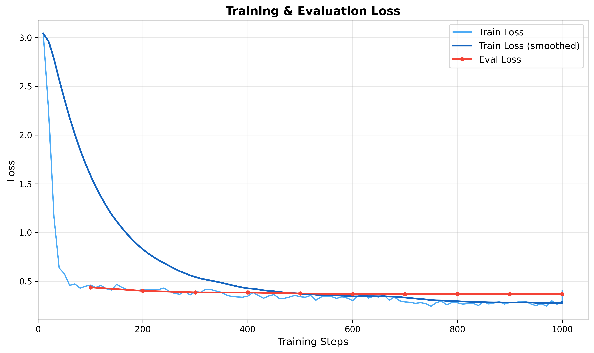
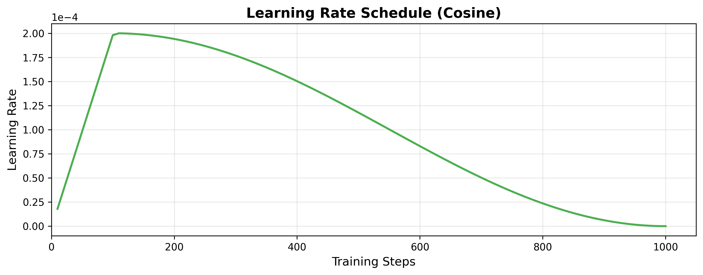
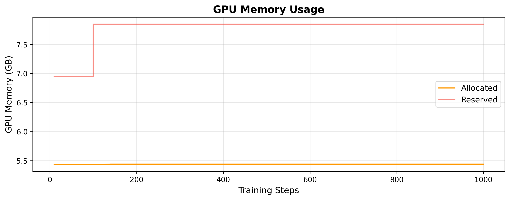

# Research Log — UzABSA-LLM Project
# Fine-tuning Open-Source LLMs for Uzbek Aspect-Based Sentiment Analysis
# ======================================================================
# Author: Sanatbek Matlatipov
# Started: February 2026
# Status: In Progress
# ======================================================================


## LOG 001 — Problem Statement & Motivation
Date: Feb 2026

- ABSA for Uzbek language is under-explored; no published LLM fine-tuning work exists for this task in Uzbek.
- Existing multilingual models (mBERT, XLM-R) have limited Uzbek coverage.
- Open-source LLMs (Qwen, Llama, DeepSeek) show promise for low-resource languages via instruction tuning.
- Research question: **Can parameter-efficient fine-tuning (QLoRA) of open-source LLMs achieve competitive ABSA performance for Uzbek text?**
- Sub-questions:
  - Which base model performs best for Uzbek ABSA?
  - How does QLoRA compare to full fine-tuning for this low-resource scenario?
  - What is the impact of prompt language (Uzbek vs English instructions) on performance?


## LOG 002 — Dataset Description
Date: Feb 2026

### Primary Dataset (Annotated)
- Source: HuggingFace `Sanatbek/aspect-based-sentiment-analysis-uzbek`
- Size: **6,175 examples** (train split)
- Annotation scheme: **SemEVAL 2014 Task 4** format
- Fields per example:
  - `sentence_id`: unique identifier (format: "XXXX#Y")
  - `text`: Uzbek review sentence
  - `aspect_terms`: list of {term, polarity, from, to} — character-level spans
  - `aspect_categories`: list of {category, polarity}
- Polarity labels: `positive`, `negative`, `neutral`
- Statistics (measured):
  - Avg aspects per example: **2.53**
  - Avg text length: **6.42 words** per sentence
  - Polarity distribution: **~64% positive, ~16% negative, ~20% neutral**
- NOTE: Class imbalance exists — positive is dominant. Consider stratified splitting or weighted loss.

### Secondary Dataset (Raw/Unannotated)
- Source: sharh.commeta.uz
- Size: **5,058 raw reviews**
- Fields: review_text, object_name, rating_value, reviewer_name, review_date, source_url
- Statistics (measured):
  - Avg words: **13.55** per review
  - Avg chars: **96.26** per review
- Purpose: potential semi-supervised learning, data augmentation, domain analysis
- Cleaning pipeline: null removal → empty string removal → min length filter (10 chars) → deduplication
- NOTE: Not used for training in current experiments — reserved for future work.


## LOG 003 — Methodology: Task Formulation
Date: Feb 2026

- ABSA reformulated as **text generation** task (instruction tuning)
- Input: Uzbek review sentence + task instruction
- Output: structured JSON containing extracted aspects with polarities
- Template format: **ChatML** (`<|im_start|>system/user/assistant<|im_end|>`)
- This is a **joint extraction** approach — model extracts both aspect terms and their sentiment in a single pass

### Instruction Format (Uzbek prompt — used for training)
```
System: Siz o'zbek tilida matnlardan aspektlarni va ularning hissiyotlarini 
        aniqlash bo'yicha mutaxassissiz. [...]
User:   Quyidagi o'zbek tilidagi matndan aspektlarni, kategoriyalarni va 
        hissiyot polaritesini aniqlang:
        Matn: "{text}"
Output: {"aspects": [{"term": "...", "category": "...", "polarity": "..."}]}
```

- NOTE: JSON output format chosen for parseability — allows automatic metric computation
- NOTE: Uzbek-language system prompt used by default; English alternative available for ablation study


## LOG 004 — Model Selection
Date: Feb 2026

### Candidate Models (all 4-bit quantized via bitsandbytes)

| Model | Parameters | HuggingFace Path | Notes |
|-------|-----------|-----------------|-------|
| Qwen 2.5 7B | 7B | unsloth/Qwen2.5-7B-Instruct-bnb-4bit | Strong multilingual, good Uzbek |
| Qwen 2.5 14B | 14B | unsloth/Qwen2.5-14B-Instruct-bnb-4bit | Larger capacity |
| Qwen 2.5 32B | 32B | unsloth/Qwen2.5-32B-Instruct-bnb-4bit | Highest capacity |
| Llama 3 8B | 8B | unsloth/llama-3-8b-Instruct-bnb-4bit | Meta's flagship |
| Llama 3.1 8B | 8B | unsloth/Meta-Llama-3.1-8B-Instruct-bnb-4bit | Updated Llama |
| Llama 3.2 3B | 3B | unsloth/Llama-3.2-3B-Instruct-bnb-4bit | Smallest, fastest |
| DeepSeek 7B | 7B | unsloth/DeepSeek-R1-Distill-Qwen-7B-bnb-4bit | Distilled reasoning |
| DeepSeek 14B | 14B | unsloth/DeepSeek-R1-Distill-Qwen-14B-bnb-4bit | Larger reasoning |
| Mistral 7B | 7B | unsloth/mistral-7b-instruct-v0.3-bnb-4bit | Efficient architecture |
| Gemma 2 9B | 9B | unsloth/gemma-2-9b-it-bnb-4bit | Google's model |

- Selection rationale: all are instruction-tuned, available in 4-bit, and cover diverse architectures
- KEY POINT FOR PAPER: Compare at least 3-4 models (e.g., Qwen 7B, Llama 3.1 8B, DeepSeek 7B, Mistral 7B) at same parameter scale for fair comparison


## LOG 005 — Fine-tuning Method: QLoRA
Date: Feb 2026

### Quantization
- Method: **QLoRA** (Dettmers et al., 2023)
- Base precision: **4-bit NormalFloat** (NF4) via bitsandbytes
- Compute dtype: **BFloat16** (bf16=True, fp16=False)
- Double quantization: enabled (Unsloth default)

### LoRA Configuration
- Rank (r): **16**
- Alpha: **32** (scaling factor = alpha/r = 2.0)
- Dropout: **0.05**
- Bias: **none**
- Target modules: `q_proj, k_proj, v_proj, o_proj, gate_proj, up_proj, down_proj`
  - All attention projections + FFN projections
  - 7 target modules per transformer layer
- RSLoRA: disabled
- LoftQ: disabled

### Training Hyperparameters
- Optimizer: **AdamW 8-bit** (memory efficient)
- Learning rate: **2e-4**
- LR scheduler: **cosine** decay
- Warmup ratio: **0.1** (10% of total steps)
- Weight decay: **0.01**
- Max gradient norm: **1.0** (gradient clipping)
- Max sequence length: **2048 tokens**
- Effective batch size: **8** (per_device=2 × grad_accum=4)
  - Auto-adjusted based on GPU memory (up to 16 on A6000)
- Max steps: **1000** (or 3 epochs if max_steps=-1)
- Seed: **42**
- Packing: **disabled** (each example processed individually)
- Gradient checkpointing: **enabled** (Unsloth optimized variant)
- Trainer: **SFTTrainer** from TRL library

### Optimization Framework
- Library: **Unsloth** — claims 2x faster training, 80% less memory
- KEY POINT: Unsloth provides fused kernels and optimized gradient checkpointing
- NOTE: Report actual training time and peak memory as empirical evidence

### Data Split
- Train/Validation: **90/10** split (stratified shuffle, seed=42)
- ~5,558 train / ~617 validation (estimated from 6,175 total)
- NOTE: No separate test set — consider k-fold or holding out a test set


## LOG 006 — Evaluation Metrics
Date: Feb 2026

### Aspect Term Extraction (ATE)
- **Exact match**: predicted term must exactly equal gold term (case-insensitive, stripped)
- **Partial match**: substring or superstring matching (relaxed criterion)
- Micro-averaged Precision, Recall, F1:
  - P = TP / (TP + FP)
  - R = TP / (TP + FN)
  - F1 = 2PR / (P + R)
- Aggregation: across ALL examples (micro), not per-example average (macro)

### Aspect Sentiment Classification (ASC)
- Evaluated on **matched** aspect pairs only — (term, polarity) tuple must match
- Same micro P/R/F1 formulation
- Additionally:
  - Sentiment accuracy (sklearn accuracy_score)
  - Sentiment macro-F1 (sklearn, zero_division=0)

### Joint ABSA Metric
- Aspect-polarity pair F1 captures joint extraction + classification
- KEY POINT: This is the primary metric — captures end-to-end performance

### Output Parsing
- Model output parsed via JSON extraction (regex: `r'\{[\s\S]*\}'`)
- Fallback: regex-based term/polarity extraction for malformed JSON
- KEY METRIC TO REPORT: **JSON parse success rate** — indicates model's instruction-following ability
- Inference: greedy decoding (temperature=0.1, do_sample=False), max_new_tokens=512


## LOG 007 — Hardware & Infrastructure
Date: Feb 2026

### GPU Setup
- **4x NVIDIA RTX A6000** (48GB VRAM each, 192GB total)
  - Ampere architecture (SM 8.6)
  - CUDA 12.8
- Planning to use **1-2 GPUs** per experiment
- Single A6000 config: batch_size=8, grad_accum=2 → effective batch=16
- Dual A6000 config: batch_size=8, grad_accum=2, DDP → effective batch=32

### Software Stack
- Python 3.10+
- PyTorch ≥ 2.1.0
- Transformers ≥ 4.45.0
- Unsloth (latest from GitHub main)
- TRL (for SFTTrainer)
- PEFT (for LoRA)
- bitsandbytes (for 4-bit quantization)
- accelerate ≥ 0.27.0

### Estimated Training Time
- ~6,175 examples × 3 epochs = ~18,525 training steps (at batch_size=1)
- With effective batch=8: ~2,316 steps per epoch → ~6,948 total
- Single A6000 @ ~25 examples/sec: ~12 min/epoch → ~37 min total
- NOTE: Record actual time per model for paper


## LOG 008 — Experiment Plan
Date: Feb 2026

### Experiment 1 — Model Comparison (Primary)
- Goal: Compare base models on Uzbek ABSA
- Models: Qwen 2.5-7B, Llama 3.1-8B, DeepSeek-7B, Mistral-7B (all at ~7B scale)
- Fixed: LoRA r=16, alpha=32, lr=2e-4, 3 epochs, same data split
- Metric: Aspect-polarity pair F1

### Experiment 2 — LoRA Rank Ablation
- Goal: Effect of LoRA rank on performance
- Values: r ∈ {4, 8, 16, 32, 64}
- Fixed: Best model from Exp 1, alpha=2r

### Experiment 3 — Prompt Language Ablation
- Goal: Uzbek vs English system prompts
- Compare: Uzbek instruction prompt vs English instruction prompt
- Fixed: Best model, best LoRA rank

### Experiment 4 — Model Scale (if time permits)
- Goal: Effect of model size
- Compare: Qwen 2.5 at 7B, 14B, 32B (or Llama 3B vs 8B)

### Experiment 5 — Zero-shot / Few-shot Baseline
- Goal: Establish baseline without fine-tuning
- Test base models (no LoRA) on same test set
- Compare: zero-shot vs few-shot (3-5 examples in prompt) vs fine-tuned


## LOG 009 — Key Claims to Support in Paper
Date: Feb 2026

1. **First** comprehensive evaluation of open-source LLMs fine-tuned for Uzbek ABSA
   - Evidence: literature review showing no prior work
   
2. QLoRA enables **efficient** fine-tuning on consumer/prosumer GPUs
   - Evidence: training time, peak VRAM usage, comparison to full fine-tuning cost
   
3. Joint aspect extraction + sentiment classification via **instruction tuning** is effective
   - Evidence: F1 scores on aspect-polarity pairs
   
4. **Model comparison** across architectures reveals best choice for Uzbek
   - Evidence: controlled experiments at same scale (Exp 1)
   
5. **Structured JSON output** from generative models is reliable
   - Evidence: JSON parse success rate > X%
   
6. **Uzbek-language prompts** affect model performance
   - Evidence: Exp 3 ablation results


## LOG 010 — Paper Structure (Planned)
Date: Feb 2026

1. **Introduction**: Low-resource ABSA, motivation for Uzbek, LLM approach
2. **Related Work**: ABSA methods, LLM fine-tuning, Uzbek NLP, QLoRA
3. **Dataset**: Description, annotation scheme (SemEVAL 2014), statistics, class distribution
4. **Methodology**:
   - Task formulation (generation-based ABSA)
   - Instruction format (ChatML, Uzbek prompts)
   - QLoRA configuration
   - Model selection
5. **Experimental Setup**: Hardware, hyperparameters, metrics, baselines
6. **Results**: Model comparison table, ablations, error analysis
7. **Discussion**: Findings, limitations, Uzbek-specific challenges
8. **Conclusion & Future Work**: Semi-supervised extension with raw data, larger datasets

### Tables to Prepare
- Table 1: Dataset statistics (size, polarity distribution, avg aspects)
- Table 2: Model comparison results (P, R, F1 for ATE and ASC)
- Table 3: LoRA rank ablation results
- Table 4: Prompt language comparison
- Table 5: Training efficiency (time, memory, parameters)

### Figures to Prepare
- Fig 1: System architecture / pipeline diagram
- Fig 2: Training loss curves (per model)
- Fig 3: Polarity distribution in dataset
- Fig 4: Confusion matrix for sentiment classification
- Fig 5: F1 vs LoRA rank plot


## LOG 011 — Important References to Cite
Date: Feb 2026

- Pontiki et al. (2014) — SemEVAL 2014 Task 4 (ABSA task definition)
- Dettmers et al. (2023) — QLoRA: Efficient Finetuning of Quantized LLMs
- Hu et al. (2022) — LoRA: Low-Rank Adaptation of LLMs
- Touvron et al. (2023) — Llama 2 (and Llama 3 tech report if available)
- Yang et al. (2024) — Qwen2.5 Technical Report
- Jiang et al. (2023) — Mistral 7B
- DeepSeek-AI (2024) — DeepSeek-R1 technical report
- Zhang et al. (2024) — Instruction tuning survey
- Unsloth — cite GitHub repo + any available paper
- Relevant Uzbek NLP papers (search needed)


## LOG 012 — Risks & Limitations (Note for Paper)
Date: Feb 2026

- Dataset size (6,175) is small by LLM standards — risk of overfitting
  - Mitigation: early stopping, validation monitoring, low epochs
- No separate test set currently — using val for evaluation
  - TODO: Create proper train/val/test split (80/10/10)
- Class imbalance (64% positive) may bias predictions
  - TODO: Report per-class F1, not just micro-average
- Uzbek tokenizer coverage unknown for each model
  - TODO: Measure tokenizer fertility (tokens/word ratio) per model
  - KEY INSIGHT: Higher fertility = less efficient encoding = potential performance impact
- Single-domain data (reviews) — generalization unclear
- JSON parsing failures reduce effective evaluation set
  - Must report parse failure rate


## LOG 013 — TODO Before Running Experiments
Date: Feb 2026

- [ ] Create proper 80/10/10 train/val/test split
- [ ] Measure tokenizer fertility for each model on Uzbek text
- [ ] Run zero-shot baselines (no fine-tuning) for comparison
- [ ] Prepare evaluation script to output publication-ready tables
- [ ] Run full data preparation on all 6,175 examples
- [ ] Execute Experiment 1 (model comparison)
- [ ] Record: training time, peak VRAM, loss curves, final metrics
- [ ] Analyze errors: what types of aspects/sentiments does model miss?
- [ ] Check if any model handles Cyrillic Uzbek (Ўзбек) vs Latin (O'zbek)


## LOG 014 — Tokenizer Fertility Analysis (TODO)
Date: Feb 2026

- This is critical for understanding model behavior on Uzbek
- Measure: avg tokens per word for each model's tokenizer
- Lower is better (model "understands" the language better)
- Example test sentences to prepare:
  ```
  "Bu restoranning ovqatlari juda mazali, lekin narxlari qimmat."
  "Xizmat ko'rsatish sifati past, kutish vaqti juda uzoq."
  "Mahsulot sifati a'lo darajada, yetkazib berish tez."
  ```
- Compare across: Qwen, Llama, DeepSeek, Mistral, Gemma tokenizers


## LOG 015 — Reproducibility Checklist
Date: Feb 2026

For paper submission, ensure:
- [ ] All hyperparameters documented (LOG 005 ✓)
- [ ] Random seed fixed (42 ✓)
- [ ] Dataset version/hash recorded
- [ ] Model versions (exact HuggingFace paths ✓)
- [ ] Hardware specified (LOG 007 ✓)
- [ ] Software versions (requirements.txt ✓)
- [ ] Training logs saved (WandB ✓)
- [ ] Code released on GitHub (repo exists ✓)
- [ ] Dataset publicly available (HuggingFace ✓)
- [ ] Statistical significance tests (multiple seeds or bootstrap)


## LOG 016 — Data Exploration: Language/Script Profiling
Date: Feb 21, 2026

### Source
- File: `./data/raw/reviews.csv`
- Total reviews loaded: **5058**
- After cleaning (drop NaN/empty `review_text`): **5058**

### Text Statistics
| Metric | Value |
|--------|-------|
| Avg words / review | 13.55 |
| Avg chars / review | 96.26 |
| Median words | 11 |
| Word range | 2–59 |
| Char range | 19–400 |

### Language/Script Classification Method
- **Character-level:** Ratio of Cyrillic (U+0400–U+04FF) vs Latin (a-z, ʻ, ʼ) characters.
  - >70 % Latin → Latin-dominant
  - >70 % Cyrillic → Cyrillic-dominant
  - 30–70 % each → Highly Mixed
- **Word-level (for Cyrillic-dominant texts):**
  - Presence of Uzbek-specific Cyrillic characters (ў, қ, ғ, ҳ) → Uzbek Cyrillic
  - High frequency of Russian function words (и, не, на, что, …) → Russian
  - Fallback heuristic using common Uzbek word list

### Results
| Language Category | Count | Percentage |
|-------------------|------:|----------:|
| Primarily Uzbek (Latin) | 4693 | 92.78% |
| Primarily Russian (Cyrillic) | 262 | 5.18% |
| Primarily Uzbek (Cyrillic) | 103 | 2.04% |

### Sample Reviews per Category
  **Primarily Uzbek (Latin)**:
  - _Rayhon milliy taomllarida hamma taomlari mazali lekin mijozlarga boʼlgan iliq munosabati menga yoqdi narxlari ham Arzon _…
  - _Bank bilan online aloqa juda qulay_…
  **Primarily Russian (Cyrillic)**:
  - _Тоже хотел рассказать про опыт онлайн-обучения. Начал проходить курс Управление Командами. Во-первых, программа хорошо в_…
  - _Платформа топовая, все понятно и легка в использовании. Опытные учителя благодаря которым леги и интересно закончил курс_…
  **Primarily Uzbek (Cyrillic)**:
  - _Жуда зур авиакомпания. Факат ш компанияда учаман. Сотрудниклар хушмуомула. Обед хр доим бор. Бошка мамлакатдагилардан ха_…
  - _Мени кизим учшохли нерви бн даволаниб чикти. Бошка жойларда килган муолажалари тасир килмаганди. Яхши хозир кайталамадик_…

### Implications for ABSA Fine-tuning
- The dataset is **predominantly Uzbek in Latin script** (92.78%).
- A non-trivial minority of reviews is in **Russian (Cyrillic)**, which affects tokenizer coverage and model selection.
- Presence of Uzbek-in-Cyrillic texts (legacy Soviet-era orthography) adds further script diversity.
- **Recommendation:** Consider script-aware preprocessing or filtering for monolingual experiments.


## LOG 017 — Data Exploration: Business Category & ABSA Subcategory Analysis
Date: Feb 21, 2026

### Source
- File: `./data/raw/reviews.csv`
- Total reviews loaded: **5058**
- After cleaning (drop NaN/empty `review_text`): **5058**
- Unique businesses: **630**

### Text Statistics
| Metric | Value |
|--------|-------|
| Avg words / review | 13.55 |
| Avg chars / review | 96.26 |
| Median words | 11 |
| Word range | 2–59 |
| Char range | 19–400 |

### Language/Script Classification Results
| Language Category | Count | Percentage |
|-------------------|------:|----------:|
| Primarily Uzbek (Latin) | 4693 | 92.78% |
| Primarily Russian (Cyrillic) | 262 | 5.18% |
| Primarily Uzbek (Cyrillic) | 103 | 2.04% |

### Sample Reviews per Language Category
  **Primarily Uzbek (Latin)**:
  - _Rayhon milliy taomllarida hamma taomlari mazali lekin mijozlarga boʼlgan iliq munosabati menga yoqdi narxlari ham Arzon _…
  - _Bank bilan online aloqa juda qulay_…
  **Primarily Russian (Cyrillic)**:
  - _Тоже хотел рассказать про опыт онлайн-обучения. Начал проходить курс Управление Командами. Во-первых, программа хорошо в_…
  - _Платформа топовая, все понятно и легка в использовании. Опытные учителя благодаря которым леги и интересно закончил курс_…
  **Primarily Uzbek (Cyrillic)**:
  - _Жуда зур авиакомпания. Факат ш компанияда учаман. Сотрудниклар хушмуомула. Обед хр доим бор. Бошка мамлакатдагилардан ха_…
  - _Мени кизим учшохли нерви бн даволаниб чикти. Бошка жойларда килган муолажалари тасир килмаганди. Яхши хозир кайталамадик_…

### Business Category Classification
- **Method:** Keyword-based mapping from `object_name` to business domain
- **Total categories identified:** 23

| Business Category | Reviews | Businesses | Percentage |
|--------------------|--------:|-----------:|-----------:|
| Restoran/Ovqatlanish | 1628 | 120 | 32.19% |
| Bank/Moliya | 586 | 30 | 11.59% |
| Boshqa | 507 | 181 | 10.02% |
| To'lov tizimlari | 328 | 7 | 6.48% |
| Elektron tijorat | 296 | 15 | 5.85% |
| Ta'lim | 295 | 63 | 5.83% |
| Tibbiyot/Sog'liqni saqlash | 285 | 61 | 5.63% |
| Telekommunikatsiya | 234 | 5 | 4.63% |
| Oziq-ovqat do'konlari | 215 | 8 | 4.25% |
| Gul/Sovg'a | 173 | 10 | 3.42% |
| Texnologiya/Media | 110 | 19 | 2.17% |
| Sayohat/Turizm | 79 | 17 | 1.56% |
| Sport/Fitnes | 60 | 10 | 1.19% |
| Kitob/Nashriyot | 56 | 9 | 1.11% |
| Din/Madaniyat | 49 | 4 | 0.97% |
| Transport/Yo'l | 32 | 16 | 0.63% |
| Yetkazib berish | 30 | 10 | 0.59% |
| Ko'ngilochar | 26 | 12 | 0.51% |
| Investitsiya/Trading | 22 | 7 | 0.43% |
| Davlat xizmatlari | 16 | 5 | 0.32% |
| Bozor/BSC | 13 | 10 | 0.26% |
| Go'zallik | 11 | 8 | 0.22% |
| Sug'urta | 7 | 3 | 0.14% |

### Key Findings — Business Domain Distribution
- **Largest domain:** Restoran/Ovqatlanish (1628 reviews, 32.19%)
- The dataset covers **23** distinct business domains — this is a MULTI-DOMAIN dataset
- Unlike standard ABSA benchmarks (restaurant-only like SemEVAL 2014), our dataset spans restaurants, banks, telecom, healthcare, education, e-commerce, and more
- **This is a key contribution:** First multi-domain ABSA dataset for Uzbek language

### Predefined ABSA Subcategories per Business Domain
- Total: **119 subcategories** across **18 domains**
- These subcategories define the aspect taxonomy for annotation and model training

- **Restoran/Ovqatlanish** — Restaurants, fast food, cafes, national cuisine
  - `ovqat_sifati`
  - `xizmat_ko'rsatish`
  - `narx`
  - `tozalik`
  - `muhit`
  - `tezlik`
  - `menyu_xilma-xilligi`
  - `joylashuv`
  - `porsiya`
- **Bank/Moliya** — Banks, financial services, loans
  - `xizmat_ko'rsatish`
  - `ilova_qulayligi`
  - `kredit`
  - `foiz_stavka`
  - `tezlik`
  - `xavfsizlik`
  - `filial`
  - `qo'llab-quvvatlash`
  - `karta_xizmati`
  - `onlayn_xizmat`
- **To'lov tizimlari** — Mobile payment, fintech, digital wallets
  - `ilova_qulayligi`
  - `tezlik`
  - `xavfsizlik`
  - `qo'llab-quvvatlash`
  - `komissiya`
  - `funksionallik`
  - `ishonchlilik`
- **Telekommunikatsiya** — Mobile operators, internet service providers
  - `internet_sifati`
  - `aloqa_sifati`
  - `narx`
  - `qo'llab-quvvatlash`
  - `qamrov`
  - `tezlik`
  - `ilova_qulayligi`
- **Elektron tijorat** — Online marketplaces, e-commerce platforms
  - `mahsulot_sifati`
  - `yetkazib_berish`
  - `narx`
  - `qo'llab-quvvatlash`
  - `tanlov`
  - `qaytarish`
  - `ilova_qulayligi`
  - `to'lov`
- **Oziq-ovqat do'konlari** — Supermarkets, grocery stores, retail chains
  - `mahsulot_sifati`
  - `narx`
  - `xizmat_ko'rsatish`
  - `tozalik`
  - `tanlov`
  - `joylashuv`
  - `navbat`
- **Tibbiyot/Sog'liqni saqlash** — Hospitals, clinics, pharmacies, healthcare
  - `shifokor_malakasi`
  - `xizmat_ko'rsatish`
  - `narx`
  - `tozalik`
  - `diagnostika`
  - `navbat`
  - `jihozlar`
  - `dori`
  - `qo'llab-quvvatlash`
- **Ta'lim** — Universities, schools, courses, training centers
  - `o'qitish_sifati`
  - `o'qituvchi`
  - `narx`
  - `dastur`
  - `infratuzilma`
  - `natija`
  - `sertifikat`
  - `amaliyot`
- **Gul/Sovg'a** — Flower shops, gift stores
  - `sifat`
  - `narx`
  - `yetkazib_berish`
  - `xizmat_ko'rsatish`
  - `tanlov`
  - `tezlik`
- **Sport/Fitnes** — Gyms, fitness centers, sports facilities
  - `jihozlar`
  - `murabbiy`
  - `narx`
  - `tozalik`
  - `muhit`
  - `joylashuv`
- **Sayohat/Turizm** — Airlines, hotels, travel agencies, resorts
  - `xizmat_ko'rsatish`
  - `narx`
  - `qulaylik`
  - `tozalik`
  - `ovqat_sifati`
  - `joylashuv`
  - `xodimlar`
- **Yetkazib berish** — Delivery services, ride-hailing, logistics
  - `tezlik`
  - `narx`
  - `xizmat_ko'rsatish`
  - `ilova_qulayligi`
  - `ishonchlilik`
  - `xavfsizlik`
- **Go'zallik** — Beauty salons, cosmetics, barbershops
  - `sifat`
  - `narx`
  - `tozalik`
  - `mutaxassislik`
  - `muhit`
- **Kitob/Nashriyot** — Bookstores, publishing houses
  - `tanlov`
  - `narx`
  - `sifat`
  - `xizmat_ko'rsatish`
  - `yetkazib_berish`
- **Texnologiya/Media** — Tech platforms, media, news outlets
  - `kontent_sifati`
  - `ilova_qulayligi`
  - `ishonchlilik`
  - `reklama`
  - `qo'llab-quvvatlash`
- **Transport/Yo'l** — Transport, roads, auto services
  - `sifat`
  - `narx`
  - `xavfsizlik`
  - `qulaylik`
  - `tezlik`
- **Ko'ngilochar** — Entertainment, parks, cinema, theater
  - `ko'ngilochar_sifati`
  - `narx`
  - `xizmat_ko'rsatish`
  - `muhit`
  - `tozalik`
- **Boshqa** — Other / miscellaneous
  - `sifat`
  - `narx`
  - `xizmat_ko'rsatish`
  - `qo'llab-quvvatlash`

### Rationale for Subcategory Design
- Subcategories are designed based on:
  1. Common aspects mentioned in real reviews (observed from data)
  2. Domain-specific attributes (e.g., `kredit` for banks, `shifokor_malakasi` for healthcare)
  3. Cross-domain shared aspects (e.g., `narx`, `xizmat_ko'rsatish` appear in most domains)
- Uzbek-language category names chosen for consistency with Uzbek ABSA task
- Categories are **hierarchical**: business_category → subcategory → polarity

### Implications for ABSA Fine-tuning
- The dataset is **predominantly Uzbek in Latin script** (92.78%).
- Multi-domain nature requires **domain-aware aspect categories** (not a flat list)
- Predefined subcategories allow:
  1. Structured annotation of the raw reviews.csv dataset
  2. Category-aware training (the model learns domain-specific aspects)
  3. Evaluation per domain (compare model performance across business categories)
- **Recommendation:** Annotate raw reviews using the predefined subcategory taxonomy, then combine with the existing HuggingFace annotated dataset for a larger, richer training set.
- **Output files saved:**
  - `data/raw/absa_subcategories.json` — Full subcategory taxonomy
  - `data/raw/business_categories.json` — Business→category mapping for all 630 businesses


## LOG 018 — Experiment 1 Result: Qwen 2.5-7B Fine-tuning (COMPLETED)
Date: Feb 22, 2026

### Run Details
- **Run ID:** `uzabsa_qwen2.5-7b_20260222_001629`
- **Model:** `unsloth/Qwen2.5-7B-Instruct-bnb-4bit` (4-bit NF4)
- **GPU:** NVIDIA RTX A6000 (48GB), single GPU
- **Status:** ✅ **COMPLETED SUCCESSFULLY** (1000/1000 steps)

### Training Configuration Used
| Parameter | Value |
|-----------|-------|
| LoRA rank (r) | 16 |
| LoRA alpha | 32 |
| LoRA dropout | 0.05 |
| Learning rate | 2e-4 (cosine schedule) |
| Batch size (per device) | 4 |
| Gradient accumulation | 4 |
| Effective batch size | 16 |
| Max steps | 1000 |
| Epochs completed | 2.92 / 3 |
| Optimizer | AdamW 8-bit |
| Precision | BF16 |

### Training Results
| Metric | Value |
|--------|-------|
| Initial train loss | 3.0409 |
| Final train loss | 0.4010 |
| Min train loss | 0.2422 |
| **Loss reduction** | **86.8%** |
| Best eval loss | 0.3656 (step 1000) |
| Training runtime | 2,942 s (~49 min compute) |
| Total wall time | 282.6 min (~4.7 hr incl. eval/save) |
| Samples/sec | 5.44 |
| GPU memory allocated | ~5.4 GB |
| GPU memory reserved | ~7.8 GB |

### Loss Curve Observations
- Rapid initial convergence: loss drops from 3.04 → 0.58 in first 50 steps
- Steady decrease through training: 0.45 → 0.24 (min at late steps)
- Eval loss consistently improving: 0.436 (step 100) → 0.366 (step 1000)
- No signs of overfitting — eval loss still decreasing at termination
- **Plots saved:** `training_curves.png`, `lr_schedule.png`, `gpu_memory.png`





### Saved Artifacts
- `lora_adapters/` — LoRA adapter weights (adapter_model.safetensors)
- `merged_model/` — Full merged 16-bit model (4 safetensors shards)
- `checkpoint-800/`, `checkpoint-900/`, `checkpoint-1000/` — Training checkpoints
- `experiment_summary.json` — Full reproducibility metadata
- W&B run: `9dvndnmk` (project: uzabsa-llm)

### Dataset Used for Training
- Source: `Sanatbek/aspect-based-sentiment-analysis-uzbek` (HuggingFace)
- **Train:** 5,480 examples | **Validation:** 609 examples (90/10 split)
- Format: ChatML instruction-response pairs (see LOG 003)
- Input → Uzbek review text with ABSA extraction instruction
- Output → Structured JSON with aspects, categories, polarities

### Next Steps
- [ ] Run ABSA evaluation on Qwen 2.5-7B (P/R/F1 for ATE and ASC)
- [ ] Train remaining models: Llama 3.1-8B, DeepSeek-7B, Mistral-7B
- [ ] Compare results across architectures (Experiment 1 completion)
- [ ] Begin work on annotating raw reviews.csv with fine-tuned model

### Note on Failed Prior Runs
- Runs 1–4 (`_233911`, `_235743`, `_000337`, `_000839`) failed early due to debugging issues
- Run in `my_runcopilot-debug/` was also a debugging attempt
- All used same Qwen 2.5-7B model — only the 5th run (`_001629`) completed successfully


# ======================================================================
# END OF CURRENT LOGS — Update as experiments progress
# ======================================================================
# Next: Complete model comparison (Exp 1), then LoRA ablation (Exp 2)
# ======================================================================
