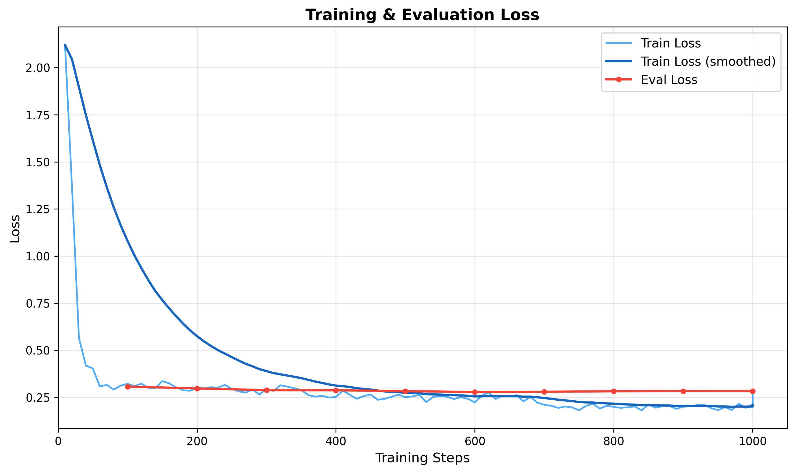
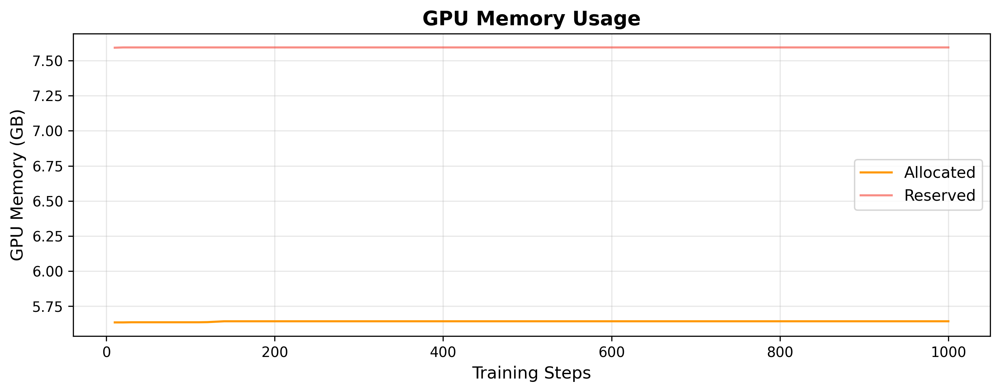
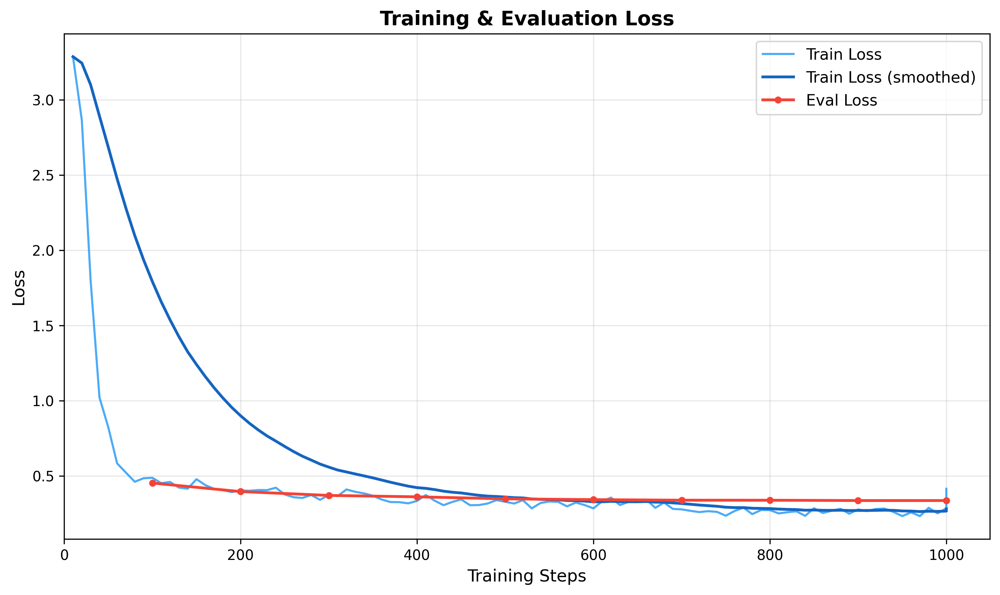
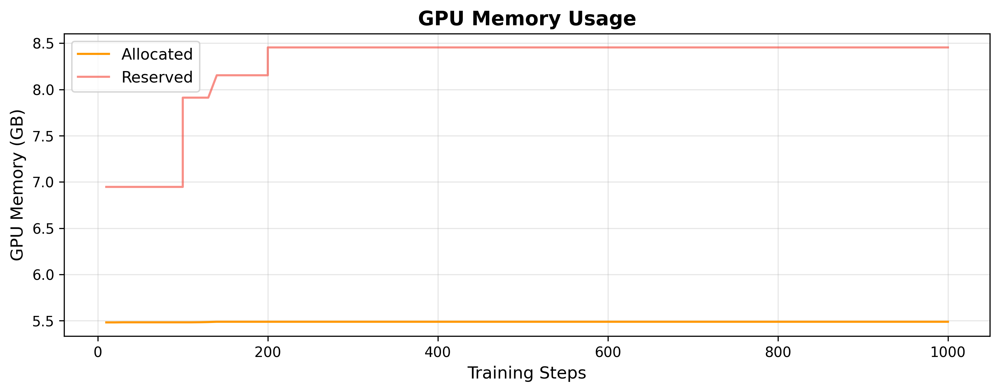

# Research Log — UzABSA-LLM Project
# Fine-tuning Open-Source LLMs for Uzbek Aspect-Based Sentiment Analysis
# ======================================================================
# Author: Sanatbek Matlatipov
# Started: February 2026
# Status: In Progress
# ======================================================================


## LOG 001 — Problem Statement & Motivation
Date: Feb 2026

- ABSA for Uzbek language is under-explored; no published LLM fine-tuning work exists for this task in Uzbek.
- Existing multilingual models (mBERT, XLM-R) have limited Uzbek coverage.
- Open-source LLMs (Qwen, Llama, DeepSeek) show promise for low-resource languages via instruction tuning.
- Research question: **Can parameter-efficient fine-tuning (QLoRA) of open-source LLMs achieve competitive ABSA performance for Uzbek text?**
- Sub-questions:
  - Which base model performs best for Uzbek ABSA?
  - How does QLoRA compare to full fine-tuning for this low-resource scenario?
  - What is the impact of prompt language (Uzbek vs English instructions) on performance?


## LOG 002 — Dataset Description
Date: Feb 2026

### Primary Dataset (Annotated)
- Source: HuggingFace `Sanatbek/aspect-based-sentiment-analysis-uzbek`
- Size: **6,175 examples** (train split)
- Annotation scheme: **SemEVAL 2014 Task 4** format
- Fields per example:
  - `sentence_id`: unique identifier (format: "XXXX#Y")
  - `text`: Uzbek review sentence
  - `aspect_terms`: list of {term, polarity, from, to} — character-level spans
  - `aspect_categories`: list of {category, polarity}
- Polarity labels: `positive`, `negative`, `neutral`, `conflict`
- Statistics (measured):
  - Total aspect terms: **7,412** | Total aspect categories: **7,724**
  - Avg aspects per example: **2.53**
  - Avg text length: **6.42 words** per sentence
  - Term polarity: positive=4,153 | negative=1,555 | neutral=1,601 | conflict=103
  - Category polarity: positive=4,488 | negative=1,547 | neutral=1,518 | conflict=171
  - Unique categories: 5 (`ovqat`, `muhit`, `xizmat`, `narx`, `boshqalar`)
  - Examples with aspect terms: 5,367/6,175 (86.9%)
  - Examples with categories only (no terms): 808 (13.1%)
- NOTE: Class imbalance exists — positive is dominant. Consider stratified splitting or weighted loss.
- NOTE: `conflict` polarity exists in data (rare: 103 term-level, 171 category-level).

### Secondary Dataset (Raw/Unannotated)
- Source: sharh.commeta.uz
- Size: **5,058 raw reviews**
- Fields: review_text, object_name, rating_value, reviewer_name, review_date, source_url
- Statistics (measured):
  - Avg words: **13.55** per review
  - Avg chars: **96.26** per review
- Purpose: potential semi-supervised learning, data augmentation, domain analysis
- Cleaning pipeline: null removal → empty string removal → min length filter (10 chars) → deduplication
- NOTE: Not used for training in current experiments — reserved for future work.


## LOG 003 — Methodology: Task Formulation
Date: Feb 2026

- ABSA reformulated as **text generation** task (instruction tuning)
- Input: Uzbek review sentence + task instruction
- Output: structured JSON containing extracted aspects with polarities
- Template format: **ChatML** (`<|im_start|>system/user/assistant<|im_end|>`)
- This is a **joint extraction** approach — model extracts both aspect terms and their sentiment in a single pass

### Instruction Format (Uzbek prompt — used for training)
```
System: Siz o'zbek tilida matnlardan aspektlarni va ularning hissiyotlarini 
        aniqlash bo'yicha mutaxassissiz. [...]
User:   Quyidagi o'zbek tilidagi matndan aspektlarni, kategoriyalarni va 
        hissiyot polaritesini aniqlang:
        Matn: "{text}"
Output: {"aspects": [{"term": "...", "category": "...", "polarity": "..."}]}
```

- NOTE: JSON output format chosen for parseability — allows automatic metric computation
- NOTE: Uzbek-language system prompt used by default; English alternative available for ablation study


## LOG 004 — Model Selection
Date: Feb 2026

### Candidate Models (all 4-bit quantized via bitsandbytes)

| Model | Parameters | HuggingFace Path | Notes |
|-------|-----------|-----------------|-------|
| Qwen 2.5 7B | 7B | unsloth/Qwen2.5-7B-Instruct-bnb-4bit | Strong multilingual, good Uzbek |
| Qwen 2.5 14B | 14B | unsloth/Qwen2.5-14B-Instruct-bnb-4bit | Larger capacity |
| Qwen 2.5 32B | 32B | unsloth/Qwen2.5-32B-Instruct-bnb-4bit | Highest capacity |
| Llama 3 8B | 8B | unsloth/llama-3-8b-Instruct-bnb-4bit | Meta's flagship |
| Llama 3.1 8B | 8B | unsloth/Meta-Llama-3.1-8B-Instruct-bnb-4bit | Updated Llama |
| Llama 3.2 3B | 3B | unsloth/Llama-3.2-3B-Instruct-bnb-4bit | Smallest, fastest |
| DeepSeek 7B | 7B | unsloth/DeepSeek-R1-Distill-Qwen-7B-bnb-4bit | Distilled reasoning |
| DeepSeek 14B | 14B | unsloth/DeepSeek-R1-Distill-Qwen-14B-bnb-4bit | Larger reasoning |
| Gemma 2 9B | 9B | unsloth/gemma-2-9b-it-bnb-4bit | Google's model |

- Selection rationale: all are instruction-tuned, available in 4-bit, and cover diverse architectures
- KEY POINT FOR PAPER: Compare 3 models (Qwen 7B, Llama 3.1 8B, DeepSeek 7B) at same parameter scale for fair comparison


## LOG 005 — Fine-tuning Method: QLoRA
Date: Feb 2026

### Quantization
- Method: **QLoRA** (Dettmers et al., 2023)
- Base precision: **4-bit NormalFloat** (NF4) via bitsandbytes
- Compute dtype: **BFloat16** (bf16=True, fp16=False)
- Double quantization: enabled (Unsloth default)

### LoRA Configuration
- Rank (r): **16**
- Alpha: **32** (scaling factor = alpha/r = 2.0)
- Dropout: **0.05**
- Bias: **none**
- Target modules: `q_proj, k_proj, v_proj, o_proj, gate_proj, up_proj, down_proj`
  - All attention projections + FFN projections
  - 7 target modules per transformer layer
- RSLoRA: disabled
- LoftQ: disabled


### Training Hyperparameters
- Optimizer: **AdamW 8-bit** (memory efficient)
- Learning rate: **2e-4**
- LR scheduler: **cosine** decay
- Warmup ratio: **0.1** (10% of total steps)
- Weight decay: **0.01**
- Max gradient norm: **1.0** (gradient clipping)
- Max sequence length: **2048 tokens**
- Effective batch size: **8** (per_device=2 × grad_accum=4)
  - Auto-adjusted based on GPU memory (up to 16 on A6000)
- Max steps: **1000** (or 3 epochs if max_steps=-1)
- Seed: **42**
- Packing: **disabled** (each example processed individually)
- Gradient checkpointing: **enabled** (Unsloth optimized variant)
- Trainer: **SFTTrainer** from TRL library

### Optimization Framework
- Library: **Unsloth** — claims 2x faster training, 80% less memory
- KEY POINT: Unsloth provides fused kernels and optimized gradient checkpointing
- NOTE: Report actual training time and peak memory as empirical evidence

### Data Split
- **Initial split (used for Qwen 2.5-7B training):** 90/10 train/val → 5,480 train / 609 val
- **Recommended split (for paper):** 80/10/10 train/dev/test → 4,940 / 617 / 618 (see LOG 019)
- Seed: 42, random shuffle
- NOTE: Future experiments should use the 80/10/10 split with a held-out test set for final evaluation


## LOG 006 — Evaluation Metrics
Date: Feb 2026

### Aspect Term Extraction (ATE)
- **Exact match**: predicted term must exactly equal gold term (case-insensitive, stripped)
- **Partial match**: substring or superstring matching (relaxed criterion)
- Micro-averaged Precision, Recall, F1:
  - P = TP / (TP + FP)
  - R = TP / (TP + FN)
  - F1 = 2PR / (P + R)
- Aggregation: across ALL examples (micro), not per-example average (macro)

### Aspect Sentiment Classification (ASC)
- Evaluated on **matched** aspect pairs only — (term, polarity) tuple must match
- Same micro P/R/F1 formulation
- Additionally:
  - Sentiment accuracy (sklearn accuracy_score)
  - Sentiment macro-F1 (sklearn, zero_division=0)

### Joint ABSA Metric
- Aspect-polarity pair F1 captures joint extraction + classification
- KEY POINT: This is the primary metric — captures end-to-end performance

### Output Parsing
- Model output parsed via JSON extraction (regex: `r'\{[\s\S]*\}'`)
- Fallback: regex-based term/polarity extraction for malformed JSON
- KEY METRIC TO REPORT: **JSON parse success rate** — indicates model's instruction-following ability
- Inference: greedy decoding (temperature=0.1, do_sample=False), max_new_tokens=512


## LOG 007 — Hardware & Infrastructure
Date: Feb 2026

### GPU Setup
- **4x NVIDIA RTX A6000** (48GB VRAM each, 192GB total)
  - Ampere architecture (SM 8.6)
  - CUDA 12.8
- Planning to use **1-2 GPUs** per experiment
- Single A6000 config: batch_size=8, grad_accum=2 → effective batch=16
- Dual A6000 config: batch_size=8, grad_accum=2, DDP → effective batch=32

### Software Stack
- Python 3.10+
- PyTorch ≥ 2.1.0
- Transformers ≥ 4.45.0
- Unsloth (latest from GitHub main)
- TRL (for SFTTrainer)
- PEFT (for LoRA)
- bitsandbytes (for 4-bit quantization)
- accelerate ≥ 0.27.0

### Estimated Training Time
- ~6,175 examples × 3 epochs = ~18,525 training steps (at batch_size=1)
- With effective batch=8: ~2,316 steps per epoch → ~6,948 total
- Single A6000 @ ~25 examples/sec: ~12 min/epoch → ~37 min total
- NOTE: Record actual time per model for paper


## LOG 008 — Experiment Plan
Date: Feb 2026

### Experiment 1 — Model Comparison (Primary)
- Goal: Compare base models on Uzbek ABSA
- Models: Qwen 2.5-7B, Llama 3.1-8B, DeepSeek-7B (all at ~7B scale)
- Fixed: LoRA r=16, alpha=32, lr=2e-4, 3 epochs, same data split
- Metric: Aspect-polarity pair F1

### Experiment 2 — LoRA Rank Ablation
- Goal: Effect of LoRA rank on performance
- Values: r ∈ {4, 8, 16, 32, 64}
- Fixed: Best model from Exp 1, alpha=2r

### Experiment 3 — Prompt Language Ablation
- Goal: Uzbek vs English system prompts
- Compare: Uzbek instruction prompt vs English instruction prompt
- Fixed: Best model, best LoRA rank

### Experiment 4 — Model Scale (if time permits)
- Goal: Effect of model size
- Compare: Qwen 2.5 at 7B, 14B, 32B (or Llama 3B vs 8B)

### Experiment 5 — Zero-shot / Few-shot Baseline
- Goal: Establish baseline without fine-tuning
- Test base models (no LoRA) on same test set
- Compare: zero-shot vs few-shot (3-5 examples in prompt) vs fine-tuned


## LOG 009 — Key Claims to Support in Paper
Date: Feb 2026

1. **First** comprehensive evaluation of open-source LLMs fine-tuned for Uzbek ABSA
   - Evidence: literature review showing no prior work
   
2. QLoRA enables **efficient** fine-tuning on consumer/prosumer GPUs
   - Evidence: training time, peak VRAM usage, comparison to full fine-tuning cost
   
3. Joint aspect extraction + sentiment classification via **instruction tuning** is effective
   - Evidence: F1 scores on aspect-polarity pairs
   
4. **Model comparison** across architectures reveals best choice for Uzbek
   - Evidence: controlled experiments at same scale (Exp 1)
   
5. **Structured JSON output** from generative models is reliable
   - Evidence: JSON parse success rate > X%
   
6. **Uzbek-language prompts** affect model performance
   - Evidence: Exp 3 ablation results


## LOG 010 — Paper Structure (Planned)
Date: Feb 2026

1. **Introduction**: Low-resource ABSA, motivation for Uzbek, LLM approach
2. **Related Work**: ABSA methods, LLM fine-tuning, Uzbek NLP, QLoRA
3. **Dataset**: Description, annotation scheme (SemEVAL 2014), statistics, class distribution
4. **Methodology**:
   - Task formulation (generation-based ABSA)
   - Instruction format (ChatML, Uzbek prompts)
   - QLoRA configuration
   - Model selection
5. **Experimental Setup**: Hardware, hyperparameters, metrics, baselines
6. **Results**: Model comparison table, ablations, error analysis
7. **Discussion**: Findings, limitations, Uzbek-specific challenges
8. **Conclusion & Future Work**: Semi-supervised extension with raw data, larger datasets

### Tables to Prepare
- Table 1: Dataset statistics (size, polarity distribution, avg aspects)
- Table 2: Model comparison results (P, R, F1 for ATE and ASC)
- Table 3: LoRA rank ablation results
- Table 4: Prompt language comparison
- Table 5: Training efficiency (time, memory, parameters)

### Figures to Prepare
- Fig 1: System architecture / pipeline diagram
- Fig 2: Training loss curves (per model)
- Fig 3: Polarity distribution in dataset
- Fig 4: Confusion matrix for sentiment classification
- Fig 5: F1 vs LoRA rank plot


## LOG 011 — Important References to Cite
Date: Feb 2026

- Pontiki et al. (2014) — SemEVAL 2014 Task 4 (ABSA task definition)
- Dettmers et al. (2023) — QLoRA: Efficient Finetuning of Quantized LLMs
- Hu et al. (2022) — LoRA: Low-Rank Adaptation of LLMs
- Touvron et al. (2023) — Llama 2 (and Llama 3 tech report if available)
- Yang et al. (2024) — Qwen2.5 Technical Report
- DeepSeek-AI (2024) — DeepSeek-R1 technical report
- Zhang et al. (2024) — Instruction tuning survey
- Unsloth — cite GitHub repo + any available paper
- Relevant Uzbek NLP papers (search needed)


## LOG 012 — Risks & Limitations (Note for Paper)
Date: Feb 2026

- Dataset size (6,175) is small by LLM standards — risk of overfitting
  - Mitigation: early stopping, validation monitoring, low epochs
- No separate test set currently — using val for evaluation
  - TODO: Create proper train/val/test split (80/10/10)
- Class imbalance (64% positive) may bias predictions
  - TODO: Report per-class F1, not just micro-average
- Uzbek tokenizer coverage unknown for each model
  - TODO: Measure tokenizer fertility (tokens/word ratio) per model
  - KEY INSIGHT: Higher fertility = less efficient encoding = potential performance impact
- Single-domain data (reviews) — generalization unclear
- JSON parsing failures reduce effective evaluation set
  - Must report parse failure rate


## LOG 013 — TODO Before Running Experiments
Date: Feb 2026

- [ ] Create proper 80/10/10 train/val/test split
- [ ] Measure tokenizer fertility for each model on Uzbek text
- [ ] Run zero-shot baselines (no fine-tuning) for comparison
- [ ] Prepare evaluation script to output publication-ready tables
- [ ] Run full data preparation on all 6,175 examples
- [ ] Execute Experiment 1 (model comparison)
- [ ] Record: training time, peak VRAM, loss curves, final metrics
- [ ] Analyze errors: what types of aspects/sentiments does model miss?
- [ ] Check if any model handles Cyrillic Uzbek (Ўзбек) vs Latin (O'zbek)


## LOG 014 — Tokenizer Fertility Analysis (TODO)
Date: Feb 2026

- This is critical for understanding model behavior on Uzbek
- Measure: avg tokens per word for each model's tokenizer
- Lower is better (model "understands" the language better)
- Example test sentences to prepare:
  ```
  "Bu restoranning ovqatlari juda mazali, lekin narxlari qimmat."
  "Xizmat ko'rsatish sifati past, kutish vaqti juda uzoq."
  "Mahsulot sifati a'lo darajada, yetkazib berish tez."
  ```
- Compare across: Qwen, Llama, DeepSeek, Gemma tokenizers


## LOG 015 — Reproducibility Checklist
Date: Feb 2026

For paper submission, ensure:
- [ ] All hyperparameters documented (LOG 005 ✓)
- [ ] Random seed fixed (42 ✓)
- [ ] Dataset version/hash recorded
- [ ] Model versions (exact HuggingFace paths ✓)
- [ ] Hardware specified (LOG 007 ✓)
- [ ] Software versions (requirements.txt ✓)
- [ ] Training logs saved (WandB ✓)
- [ ] Code released on GitHub (repo exists ✓)
- [ ] Dataset publicly available (HuggingFace ✓)
- [ ] Fine-tuned models publicly available on HuggingFace Hub: [Sanatbek/UzABSA-LLM](https://huggingface.co/Sanatbek/UzABSA-LLM/tree/main) (Add as footnote in paper)
- [ ] Statistical significance tests (multiple seeds or bootstrap)


## LOG 016 — Data Exploration: Language/Script Profiling
Date: Feb 21, 2026

### Source
- File: `./data/raw/reviews.csv`
- Total reviews loaded: **5058**
- After cleaning (drop NaN/empty `review_text`): **5058**

### Text Statistics
| Metric | Value |
|--------|-------|
| Avg words / review | 13.55 |
| Avg chars / review | 96.26 |
| Median words | 11 |
| Word range | 2–59 |
| Char range | 19–400 |

### Language/Script Classification Method
- **Character-level:** Ratio of Cyrillic (U+0400–U+04FF) vs Latin (a-z, ʻ, ʼ) characters.
  - >70 % Latin → Latin-dominant
  - >70 % Cyrillic → Cyrillic-dominant
  - 30–70 % each → Highly Mixed
- **Word-level (for Cyrillic-dominant texts):**
  - Presence of Uzbek-specific Cyrillic characters (ў, қ, ғ, ҳ) → Uzbek Cyrillic
  - High frequency of Russian function words (и, не, на, что, …) → Russian
  - Fallback heuristic using common Uzbek word list

### Results
| Language Category | Count | Percentage |
|-------------------|------:|----------:|
| Primarily Uzbek (Latin) | 4693 | 92.78% |
| Primarily Russian (Cyrillic) | 262 | 5.18% |
| Primarily Uzbek (Cyrillic) | 103 | 2.04% |

### Sample Reviews per Category
  **Primarily Uzbek (Latin)**:
  - _Rayhon milliy taomllarida hamma taomlari mazali lekin mijozlarga boʼlgan iliq munosabati menga yoqdi narxlari ham Arzon _…
  - _Bank bilan online aloqa juda qulay_…
  **Primarily Russian (Cyrillic)**:
  - _Тоже хотел рассказать про опыт онлайн-обучения. Начал проходить курс Управление Командами. Во-первых, программа хорошо в_…
  - _Платформа топовая, все понятно и легка в использовании. Опытные учителя благодаря которым леги и интересно закончил курс_…
  **Primarily Uzbek (Cyrillic)**:
  - _Жуда зур авиакомпания. Факат ш компанияда учаман. Сотрудниклар хушмуомула. Обед хр доим бор. Бошка мамлакатдагилардан ха_…
  - _Мени кизим учшохли нерви бн даволаниб чикти. Бошка жойларда килган муолажалари тасир килмаганди. Яхши хозир кайталамадик_…

### Implications for ABSA Fine-tuning
- The dataset is **predominantly Uzbek in Latin script** (92.78%).
- A non-trivial minority of reviews is in **Russian (Cyrillic)**, which affects tokenizer coverage and model selection.
- Presence of Uzbek-in-Cyrillic texts (legacy Soviet-era orthography) adds further script diversity.
- **Recommendation:** Consider script-aware preprocessing or filtering for monolingual experiments.


## LOG 017 — Data Exploration: Business Category & ABSA Subcategory Analysis
Date: Feb 21, 2026

### Source
- File: `./data/raw/reviews.csv`
- Total reviews loaded: **5058**
- After cleaning (drop NaN/empty `review_text`): **5058**
- Unique businesses: **630**

### Text Statistics
| Metric | Value |
|--------|-------|
| Avg words / review | 13.55 |
| Avg chars / review | 96.26 |
| Median words | 11 |
| Word range | 2–59 |
| Char range | 19–400 |

### Language/Script Classification Results
| Language Category | Count | Percentage |
|-------------------|------:|----------:|
| Primarily Uzbek (Latin) | 4693 | 92.78% |
| Primarily Russian (Cyrillic) | 262 | 5.18% |
| Primarily Uzbek (Cyrillic) | 103 | 2.04% |

### Sample Reviews per Language Category
  **Primarily Uzbek (Latin)**:
  - _Rayhon milliy taomllarida hamma taomlari mazali lekin mijozlarga boʼlgan iliq munosabati menga yoqdi narxlari ham Arzon _…
  - _Bank bilan online aloqa juda qulay_…
  **Primarily Russian (Cyrillic)**:
  - _Тоже хотел рассказать про опыт онлайн-обучения. Начал проходить курс Управление Командами. Во-первых, программа хорошо в_…
  - _Платформа топовая, все понятно и легка в использовании. Опытные учителя благодаря которым леги и интересно закончил курс_…
  **Primarily Uzbek (Cyrillic)**:
  - _Жуда зур авиакомпания. Факат ш компанияда учаман. Сотрудниклар хушмуомула. Обед хр доим бор. Бошка мамлакатдагилардан ха_…
  - _Мени кизим учшохли нерви бн даволаниб чикти. Бошка жойларда килган муолажалари тасир килмаганди. Яхши хозир кайталамадик_…

### Business Category Classification
- **Method:** Keyword-based mapping from `object_name` to business domain
- **Total categories identified:** 23

| Business Category | Reviews | Businesses | Percentage |
|--------------------|--------:|-----------:|-----------:|
| Restoran/Ovqatlanish | 1628 | 120 | 32.19% |
| Bank/Moliya | 586 | 30 | 11.59% |
| Boshqa | 507 | 181 | 10.02% |
| To'lov tizimlari | 328 | 7 | 6.48% |
| Elektron tijorat | 296 | 15 | 5.85% |
| Ta'lim | 295 | 63 | 5.83% |
| Tibbiyot/Sog'liqni saqlash | 285 | 61 | 5.63% |
| Telekommunikatsiya | 234 | 5 | 4.63% |
| Oziq-ovqat do'konlari | 215 | 8 | 4.25% |
| Gul/Sovg'a | 173 | 10 | 3.42% |
| Texnologiya/Media | 110 | 19 | 2.17% |
| Sayohat/Turizm | 79 | 17 | 1.56% |
| Sport/Fitnes | 60 | 10 | 1.19% |
| Kitob/Nashriyot | 56 | 9 | 1.11% |
| Din/Madaniyat | 49 | 4 | 0.97% |
| Transport/Yo'l | 32 | 16 | 0.63% |
| Yetkazib berish | 30 | 10 | 0.59% |
| Ko'ngilochar | 26 | 12 | 0.51% |
| Investitsiya/Trading | 22 | 7 | 0.43% |
| Davlat xizmatlari | 16 | 5 | 0.32% |
| Bozor/BSC | 13 | 10 | 0.26% |
| Go'zallik | 11 | 8 | 0.22% |
| Sug'urta | 7 | 3 | 0.14% |

### Key Findings — Business Domain Distribution
- **Largest domain:** Restoran/Ovqatlanish (1628 reviews, 32.19%)
- The dataset covers **23** distinct business domains — this is a MULTI-DOMAIN dataset
- Unlike standard ABSA benchmarks (restaurant-only like SemEVAL 2014), our dataset spans restaurants, banks, telecom, healthcare, education, e-commerce, and more
- **This is a key contribution:** First multi-domain ABSA dataset for Uzbek language

### Predefined ABSA Subcategories per Business Domain
- Total: **119 subcategories** across **18 domains**
- These subcategories define the aspect taxonomy for annotation and model training

- **Restoran/Ovqatlanish** — Restaurants, fast food, cafes, national cuisine
  - `ovqat_sifati`
  - `xizmat_ko'rsatish`
  - `narx`
  - `tozalik`
  - `muhit`
  - `tezlik`
  - `menyu_xilma-xilligi`
  - `joylashuv`
  - `porsiya`
- **Bank/Moliya** — Banks, financial services, loans
  - `xizmat_ko'rsatish`
  - `ilova_qulayligi`
  - `kredit`
  - `foiz_stavka`
  - `tezlik`
  - `xavfsizlik`
  - `filial`
  - `qo'llab-quvvatlash`
  - `karta_xizmati`
  - `onlayn_xizmat`
- **To'lov tizimlari** — Mobile payment, fintech, digital wallets
  - `ilova_qulayligi`
  - `tezlik`
  - `xavfsizlik`
  - `qo'llab-quvvatlash`
  - `komissiya`
  - `funksionallik`
  - `ishonchlilik`
- **Telekommunikatsiya** — Mobile operators, internet service providers
  - `internet_sifati`
  - `aloqa_sifati`
  - `narx`
  - `qo'llab-quvvatlash`
  - `qamrov`
  - `tezlik`
  - `ilova_qulayligi`
- **Elektron tijorat** — Online marketplaces, e-commerce platforms
  - `mahsulot_sifati`
  - `yetkazib_berish`
  - `narx`
  - `qo'llab-quvvatlash`
  - `tanlov`
  - `qaytarish`
  - `ilova_qulayligi`
  - `to'lov`
- **Oziq-ovqat do'konlari** — Supermarkets, grocery stores, retail chains
  - `mahsulot_sifati`
  - `narx`
  - `xizmat_ko'rsatish`
  - `tozalik`
  - `tanlov`
  - `joylashuv`
  - `navbat`
- **Tibbiyot/Sog'liqni saqlash** — Hospitals, clinics, pharmacies, healthcare
  - `shifokor_malakasi`
  - `xizmat_ko'rsatish`
  - `narx`
  - `tozalik`
  - `diagnostika`
  - `navbat`
  - `jihozlar`
  - `dori`
  - `qo'llab-quvvatlash`
- **Ta'lim** — Universities, schools, courses, training centers
  - `o'qitish_sifati`
  - `o'qituvchi`
  - `narx`
  - `dastur`
  - `infratuzilma`
  - `natija`
  - `sertifikat`
  - `amaliyot`
- **Gul/Sovg'a** — Flower shops, gift stores
  - `sifat`
  - `narx`
  - `yetkazib_berish`
  - `xizmat_ko'rsatish`
  - `tanlov`
  - `tezlik`
- **Sport/Fitnes** — Gyms, fitness centers, sports facilities
  - `jihozlar`
  - `murabbiy`
  - `narx`
  - `tozalik`
  - `muhit`
  - `joylashuv`
- **Sayohat/Turizm** — Airlines, hotels, travel agencies, resorts
  - `xizmat_ko'rsatish`
  - `narx`
  - `qulaylik`
  - `tozalik`
  - `ovqat_sifati`
  - `joylashuv`
  - `xodimlar`
- **Yetkazib berish** — Delivery services, ride-hailing, logistics
  - `tezlik`
  - `narx`
  - `xizmat_ko'rsatish`
  - `ilova_qulayligi`
  - `ishonchlilik`
  - `xavfsizlik`
- **Go'zallik** — Beauty salons, cosmetics, barbershops
  - `sifat`
  - `narx`
  - `tozalik`
  - `mutaxassislik`
  - `muhit`
- **Kitob/Nashriyot** — Bookstores, publishing houses
  - `tanlov`
  - `narx`
  - `sifat`
  - `xizmat_ko'rsatish`
  - `yetkazib_berish`
- **Texnologiya/Media** — Tech platforms, media, news outlets
  - `kontent_sifati`
  - `ilova_qulayligi`
  - `ishonchlilik`
  - `reklama`
  - `qo'llab-quvvatlash`
- **Transport/Yo'l** — Transport, roads, auto services
  - `sifat`
  - `narx`
  - `xavfsizlik`
  - `qulaylik`
  - `tezlik`
- **Ko'ngilochar** — Entertainment, parks, cinema, theater
  - `ko'ngilochar_sifati`
  - `narx`
  - `xizmat_ko'rsatish`
  - `muhit`
  - `tozalik`
- **Boshqa** — Other / miscellaneous
  - `sifat`
  - `narx`
  - `xizmat_ko'rsatish`
  - `qo'llab-quvvatlash`

### Rationale for Subcategory Design
- Subcategories are designed based on:
  1. Common aspects mentioned in real reviews (observed from data)
  2. Domain-specific attributes (e.g., `kredit` for banks, `shifokor_malakasi` for healthcare)
  3. Cross-domain shared aspects (e.g., `narx`, `xizmat_ko'rsatish` appear in most domains)
- Uzbek-language category names chosen for consistency with Uzbek ABSA task
- Categories are **hierarchical**: business_category → subcategory → polarity

### Implications for ABSA Fine-tuning
- The dataset is **predominantly Uzbek in Latin script** (92.78%).
- Multi-domain nature requires **domain-aware aspect categories** (not a flat list)
- Predefined subcategories allow:
  1. Structured annotation of the raw reviews.csv dataset
  2. Category-aware training (the model learns domain-specific aspects)
  3. Evaluation per domain (compare model performance across business categories)
- **Recommendation:** Annotate raw reviews using the predefined subcategory taxonomy, then combine with the existing HuggingFace annotated dataset for a larger, richer training set.
- **Output files saved:**
  - `data/raw/absa_subcategories.json` — Full subcategory taxonomy
  - `data/raw/business_categories.json` — Business→category mapping for all 630 businesses


## LOG 018 — Experiment 1 Result: Qwen 2.5-7B Fine-tuning (COMPLETED)
Date: Feb 22, 2026

### Run Details
- **Run ID:** `uzabsa_qwen2.5-7b_20260222_001629`
- **Model:** `unsloth/Qwen2.5-7B-Instruct-bnb-4bit` (4-bit NF4)
- **GPU:** NVIDIA RTX A6000 (48GB), single GPU
- **Status:** ✅ **COMPLETED SUCCESSFULLY** (1000/1000 steps)

### Training Configuration Used
| Parameter | Value |
|-----------|-------|
| LoRA rank (r) | 16 |
| LoRA alpha | 32 |
| LoRA dropout | 0.05 |
| Learning rate | 2e-4 (cosine schedule) |
| Batch size (per device) | 4 |
| Gradient accumulation | 4 |
| Effective batch size | 16 |
| Max steps | 1000 |
| Epochs completed | 2.92 / 3 |
| Optimizer | AdamW 8-bit |
| Precision | BF16 |

### Training Results
| Metric | Value |
|--------|-------|
| Initial train loss | 3.0409 |
| Final train loss | 0.4010 |
| Min train loss | 0.2422 |
| **Loss reduction** | **86.8%** |
| Best eval loss | 0.3656 (step 1000) |
| Training runtime | 2,942 s (~49 min compute) |
| Total wall time | 282.6 min (~4.7 hr incl. eval/save) |
| Samples/sec | 5.44 |
| GPU memory allocated | ~5.4 GB |
| GPU memory reserved | ~7.8 GB |

### Loss Curve Observations
- Rapid initial convergence: loss drops from 3.04 → 0.58 in first 50 steps
- Steady decrease through training: 0.45 → 0.24 (min at late steps)
- Eval loss consistently improving: 0.436 (step 100) → 0.366 (step 1000)
- No signs of overfitting — eval loss still decreasing at termination
- **Plots saved:** `training_curves.png`, `lr_schedule.png`, `gpu_memory.png`


### Saved Artifacts
- `lora_adapters/` — LoRA adapter weights (adapter_model.safetensors)
- `merged_model/` — Full merged 16-bit model (4 safetensors shards)
- `checkpoint-800/`, `checkpoint-900/`, `checkpoint-1000/` — Training checkpoints
- `experiment_summary.json` — Full reproducibility metadata
- W&B run: `9dvndnmk` (project: uzabsa-llm)

### Dataset Used for Training
- Source: `Sanatbek/aspect-based-sentiment-analysis-uzbek` (HuggingFace)
- **Train:** 5,480 examples | **Validation:** 609 examples (90/10 split)
- Format: ChatML instruction-response pairs (see LOG 003)
- Input → Uzbek review text with ABSA extraction instruction
- Output → Structured JSON with aspects, categories, polarities

### Note on Failed Prior Runs
- Runs 1–4 (`_233911`, `_235743`, `_000337`, `_000839`) failed early due to debugging issues
- Run in `my_runcopilot-debug/` was also a debugging attempt
- All used same Qwen 2.5-7B model — only the 5th run (`_001629`) completed successfully


## LOG 019 — Dataset Splits & ABSA Subtask Feasibility Analysis
Date: Feb 22, 2026

### Proper Train / Dev / Test Split (80/10/10)
- Split method: random shuffle with `seed=42`, 80/10/10 ratio
- **This split should be used for all future experiments and paper results**

#### Full Dataset Statistics

| Statistic | Train | Dev | Test | Total |
|-----------|------:|----:|-----:|------:|
| **Sentences** | 4,940 | 617 | 618 | 6,175 |
| **Aspect Terms** | 5,923 | 755 | 734 | 7,412 |
| **Unique Terms** | 2,169 | 367 | 376 | — |
| **Aspect Categories** | 6,166 | 790 | 768 | 7,724 |
| **Unique Categories** | 5 | 5 | 5 | 5 |

#### Aspect Term Sentiment Distribution

| Polarity | Train | Dev | Test | Total |
|----------|------:|----:|-----:|------:|
| Positive | 3,266 | 454 | 433 | 4,153 |
| Negative | 1,270 | 146 | 139 | 1,555 |
| Neutral  | 1,312 | 139 | 150 | 1,601 |
| Conflict | 75 | 16 | 12 | 103 |

#### Aspect Category Sentiment Distribution

| Polarity | Train | Dev | Test | Total |
|----------|------:|----:|-----:|------:|
| Positive | 3,548 | 478 | 462 | 4,488 |
| Negative | 1,258 | 151 | 138 | 1,547 |
| Neutral  | 1,230 | 140 | 148 | 1,518 |
| Conflict | 130 | 21 | 20 | 171 |

#### Category Labels
- `ovqat` (food), `muhit` (ambiance), `xizmat` (service), `narx` (price), `boshqalar` (miscellaneous)
- All 5 categories present in all 3 splits

### ABSA Subtask Feasibility Analysis

The dataset annotation provides: **(aspect_term, from, to, polarity)** + **(aspect_category, polarity)**.

For each subtask, the available annotation fields determine feasibility:

| Subtask | Required Tuple | Available? | Status |
|---------|---------------|------------|--------|
| **ATE** (Aspect Term Extraction) | (term) | ✅ `aspect_terms.term` | **Fully supported** |
| **ACD** (Aspect Category Detection) | (category) | ✅ `aspect_categories.category` | **Fully supported** |
| **ASC** (Aspect Sentiment Classification) | (term, polarity) | ✅ `aspect_terms.{term, polarity}` | **Fully supported** |
| **ACSC** (Aspect Category Sentiment) | (category, polarity) | ✅ `aspect_categories.{category, polarity}` | **Fully supported** |
| **E2E-ABSA** (End-to-End Joint) | (term, polarity) | ✅ | **Fully supported — current approach** |
| **TASD** (Target-Aspect-Sentiment Detection) | (term, category, polarity) | ⚠️ Partial | **Feasible with heuristic alignment** |
| **ASTE** (Aspect Sentiment Triplet Extraction) | (term, opinion_term, polarity) | ❌ No `opinion_term` | **Not supported** |
| **ACOS** (Aspect-Category-Opinion-Sentiment) | (term, category, opinion, polarity) | ❌ No `opinion_term` | **Not supported** |
| **ASQP** (Aspect Sentiment Quad Prediction) | (term, category, opinion, polarity) | ❌ No `opinion_term` | **Not supported** |

### Subtask Details

**Fully Supported (current fine-tuning covers these):**
1. **ATE** — Extract aspect terms from text. Our model outputs `{"aspects": [{"term": ...}]}`.
2. **ACD** — Detect aspect categories. Our model outputs `{"aspects": [{"category": ...}]}`.
3. **ASC** — Classify sentiment per aspect term. Our model outputs `{"aspects": [{"term": ..., "polarity": ...}]}`.
4. **ACSC** — Classify sentiment per category. Our model outputs `{"aspects": [{"category": ..., "polarity": ...}]}`.
5. **E2E-ABSA** — Joint term extraction + sentiment. This is our primary evaluation metric (pair F1).

**Feasible with Heuristic Alignment:**
6. **TASD** — Requires (term, category, sentiment) triplets. Our data has separate term and category lists per sentence. When `len(terms) == len(categories)` (4,631/6,175 = 75% of examples), positional alignment can create triplets. For remaining 25%, polarity-matching heuristic can pair them. This enables TASD evaluation on a **cleaned subset**.

**Not Supported (missing opinion_term annotation):**
7. **ASTE**, **ACOS**, **ASQP** — All require explicit `opinion_term` (the word expressing sentiment, e.g., "mazali" in "ovqat mazali"). Our dataset does not annotate opinion terms, only aspect terms and their polarities. These subtasks would require **re-annotation** of the dataset.

### Recommendation for Paper
- **Primary metrics:** ATE (P/R/F1), ASC (P/R/F1), E2E-ABSA pair F1, ACSC accuracy
- **Secondary:** TASD on the 75% aligned subset (report as supplementary)
- **Clearly state** that ASTE/ACOS/ASQP are not evaluated due to missing opinion term annotations — this is a standard limitation shared with several SemEVAL 2014 datasets
- **Future work:** Re-annotate with opinion terms to enable ASTE/ASQP


## LOG 020 — Evaluation Procedure: How to Run ABSA Evaluation
Date: Feb 22, 2026

### Running Evaluation on Qwen 2.5-7B

The evaluation pipeline consists of: (1) load fine-tuned model, (2) run inference on test/validation set, (3) parse JSON outputs, (4) compute metrics.

#### Command
```powershell
# Activate environment
.\.venv\Scripts\Activate.ps1

# Evaluate using merged model on validation set
python scripts/evaluate.py `
    --model-path ./outputs/my_run/uzabsa_qwen2.5-7b_20260222_001629/merged_model `
    --test-data ./data/processed `
    --output-dir ./outputs/my_run/uzabsa_qwen2.5-7b_20260222_001629 `
    --max-samples 100  # Remove for full eval
```

#### Metrics Computed
The evaluation script (`src/evaluation.py`) computes:

| Metric | What it Measures | Formula |
|--------|-----------------|----------|
| ATE Precision (exact) | Correctly extracted terms / all predicted terms | TP / (TP + FP) |
| ATE Recall (exact) | Correctly extracted terms / all gold terms | TP / (TP + FN) |
| ATE F1 (exact) | Harmonic mean | 2PR / (P + R) |
| ATE F1 (partial) | Relaxed: substring/superstring matching | Same formula |
| Pair Precision | Correct (term, polarity) / all predicted | TP / (TP + FP) |
| Pair Recall | Correct (term, polarity) / all gold | TP / (TP + FN) |
| **Pair F1** | **Primary metric — joint extraction + sentiment** | 2PR / (P + R) |
| Sentiment Accuracy | Correct polarity / matched terms | Accuracy |
| Sentiment Macro-F1 | Per-class F1 averaged | macro average |

#### Output Files
- `eval_results_YYYYMMDD_HHMMSS.json` — Full metric report
- Console output with formatted table

#### Important Notes
- Use **greedy decoding** (`do_sample=False`, `temperature=0.1`) for deterministic evaluation
- **JSON parse success rate** should be reported — it measures instruction-following quality
- Current evaluation uses the `validation` split; once 80/10/10 split is implemented, use the `test` split
- Evaluation requires GPU (loads the full merged model or base + LoRA adapters)


## LOG 021 — LLM-as-Judge Evaluation Framework
Date: Feb 22, 2026

### Motivation
Automatic metrics (P/R/F1) only measure exact/partial string matching. They miss:
- Semantically correct but differently worded aspect terms
- Valid aspects the gold standard missed (annotation recall < 100%)
- Quality of model outputs beyond the annotated test set
- Real-world performance on diverse domains beyond the training distribution

**LLM-as-Judge** provides a complementary evaluation by using a powerful LLM (e.g., GPT-4, Claude) to judge the quality of model predictions.

### Framework Design

#### Evaluation Dimensions (Scoring Rubric)
Each model prediction is scored on 4 dimensions (1-5 scale):

| Dimension | Description | Score Guide |
|-----------|-------------|-------------|
| **Completeness** | Did the model find ALL aspects in the text? | 5=all found, 1=most missed |
| **Accuracy** | Are extracted terms actually aspects (not noise)? | 5=all correct, 1=mostly wrong |
| **Sentiment Correctness** | Is the polarity label correct for each aspect? | 5=all correct, 1=all wrong |
| **Format Compliance** | Is the output valid JSON matching the schema? | 5=perfect JSON, 1=unparseable |

#### Data Preparation — Two-Phase Approach

**Phase 1: Judge on Annotated Test Set (Gold Standard Comparison)**
- Input: model prediction + gold standard + original text
- Judge sees both and evaluates prediction quality
- This validates LLM-as-Judge correlation with automatic metrics
- Use: **Test split (618 sentences)** from the annotated dataset

**Phase 2: Judge on Unannotated Raw Reviews (Real-World Evaluation)**
- Input: model prediction + original text (NO gold standard)
- Judge evaluates based on text comprehension alone
- **This is where `reviews.csv` is used** — the 5,058 raw reviews
- Purpose: measure real-world generalization across 23 business domains
- This evaluation covers domains NOT in the training data (banking, telecom, etc.)

#### Data Format for LLM-as-Judge

**Phase 1 prompt template (with gold standard):**
```
You are evaluating an ABSA model for Uzbek text. Score the model's output.

Original text: "{text}"
Gold standard: {gold_aspects}
Model prediction: {predicted_aspects}

Score each dimension (1-5):
1. Completeness: [1-5] — Did the model find all aspects?
2. Accuracy: [1-5] — Are predicted aspects actually present in the text?
3. Sentiment: [1-5] — Are polarity labels correct?
4. Format: [1-5] — Is the JSON output well-formed?

Explanation: <brief justification>
```

**Phase 2 prompt template (without gold, for reviews.csv):**
```
You are evaluating an ABSA model for Uzbek text. There is no gold standard.
Judge the model's output based on your understanding of the text.

Original text: "{review_text}"
Business: "{object_name}"
User rating: {rating_value}/5
Model prediction: {predicted_aspects}

Score each dimension (1-5):
1. Completeness: [1-5] — Does the output capture the main opinions?
2. Accuracy: [1-5] — Are the extracted aspects actually mentioned?
3. Sentiment: [1-5] — Do polarities match the tone of the text?
4. Format: [1-5] — Is the JSON output well-formed?

Explanation: <brief justification>
```

#### How reviews.csv Enables Multi-Domain Evaluation
The raw reviews span 23 business domains. By running inference on a stratified sample:

| Domain | Sample Size | Purpose |
|--------|------------|----------|
| Restoran/Ovqatlanish | 50 | In-domain (training data is restaurant reviews) |
| Bank/Moliya | 30 | Out-of-domain: financial services |
| Telekommunikatsiya | 20 | Out-of-domain: telecom |
| Tibbiyot/Sog'liqni saqlash | 20 | Out-of-domain: healthcare |
| Ta'lim | 20 | Out-of-domain: education |
| Elektron tijorat | 20 | Out-of-domain: e-commerce |
| Other domains | 5 each | Coverage check |
| **Total** | **~200** | Manageable for LLM-as-Judge cost |

This produces a **domain-wise quality matrix** showing how well the fine-tuned model generalizes — a key result for the paper.

#### Implementation Plan
1. Run inference on stratified sample of `reviews.csv` (~200 reviews)
2. Format predictions into judge-ready prompts
3. Submit to GPT-4 / Claude API for scoring
4. Aggregate scores per domain and per dimension
5. Report: mean scores, per-domain heatmap, correlation with automatic metrics (Phase 1)

#### Reliability Measures
- **Inter-judge agreement:** Run a subset (50 examples) through 2 different LLM judges
- **Human validation:** Manually score 30 examples, compute Spearman correlation with LLM judge scores
- **Calibration:** Phase 1 (with gold standard) establishes baseline — if LLM-as-Judge agrees with F1 ranking, it's trustworthy for Phase 2

#### Cost Estimate
- Phase 1: 618 examples × ~500 tokens each ≈ 310K tokens (~$3 with GPT-4o-mini)
- Phase 2: 200 examples × ~500 tokens each ≈ 100K tokens (~$1 with GPT-4o-mini)
- Total: ~$4-10 depending on model choice

### Key Research Value
- **Novel contribution:** First LLM-as-Judge evaluation for Uzbek ABSA
- **Bridges the gap** between automatic metrics and human judgment
- **Enables multi-domain assessment** using the unannotated `reviews.csv` — this is the path to the annotated multi-domain dataset goal
- **Practical outcome:** The LLM-as-Judge scores on `reviews.csv` can serve as **silver-standard annotations**, which can then be human-verified to create the multi-domain ABSA resource


## LOG 021b — Experiment 2 Result: Llama 3.1-8B Fine-tuning (COMPLETED)
Date: Feb 22, 2026

### Run Details
- **Run ID:** `uzabsa_llama3.1-8b_20260222_182459`
- **Model:** `unsloth/Meta-Llama-3.1-8B-Instruct-bnb-4bit` (4-bit NF4)
- **GPU:** NVIDIA RTX A6000 (48GB), single GPU
- **Status:** ✅ **COMPLETED SUCCESSFULLY** (1000/1000 steps)
- **W&B run:** `dnxp8iq3` (project: uzabsa-llm)

### Training Configuration
- Identical to Experiment 1 (LOG 018) — same LoRA config, hyperparameters, optimizer, and data split
- This ensures a **controlled comparison**: the only variable is the base model architecture

### Training Results
| Metric | Value |
|--------|-------|
| Initial train loss | 2.1197 |
| Final train loss | 0.2868 |
| Min train loss | 0.1818 |
| **Loss reduction** | **86.5%** |
| Best eval loss | 0.2785 (step 600) |
| Final eval loss | 0.2833 (step 1000) |
| Training compute time | 3,585 s (~59.8 min) |
| Total wall time | 457.5 min (~7.6 hr incl. eval/save) |
| Samples/sec | 4.46 |
| GPU memory allocated | ~5.6 GB |
| GPU memory reserved | ~7.6 GB |

### Eval Loss Progression
| Step | Epoch | Eval Loss |
|-----:|------:|----------:|
| 100 | 0.29 | 0.3075 |
| 200 | 0.58 | 0.2977 |
| 300 | 0.88 | 0.2885 |
| 400 | 1.17 | 0.2879 |
| 500 | 1.46 | 0.2834 |
| **600** | **1.75** | **0.2785** ← best |
| 700 | 2.04 | 0.2799 |
| 800 | 2.33 | 0.2827 |
| 900 | 2.62 | 0.2835 |
| 1000 | 2.92 | 0.2833 |

### Loss Curve Observations
- Llama starts with a **much lower initial loss** (2.12 vs Qwen's 3.04) — suggesting better pre-trained representation for the task or tokenizer efficiency
- Convergence is smoother: loss drops to ~0.30 by step 30, then steadily decreases
- Best eval loss reached at **step 600 (epoch 1.75)** — train loss continues decreasing but eval loss plateaus, indicating mild overfitting after ~1.75 epochs
- Gradient norms remain stable (0.27–0.45 range after warmup), indicating healthy optimization

### Saved Artifacts
- `lora_adapters/` — LoRA adapter weights
- `merged_model/` — Full merged 16-bit model
- `checkpoint-600/`, `checkpoint-900/`, `checkpoint-1000/` — Training checkpoints
- `experiment_summary.json` — Full reproducibility metadata
- **Plots:** `training_curves.png`, `lr_schedule.png`, `gpu_memory.png`





## LOG 022 — Experiment 3 Result: DeepSeek-R1-Distill-Qwen-7B Fine-tuning (COMPLETED)
Date: Feb 24, 2026

### Run Details
- **Run ID:** `uzabsa_deepseek-7b` (output: `outputs/my_run/uzabsa_deepseek-7b`)
- **Model:** `unsloth/DeepSeek-R1-Distill-Qwen-7B-bnb-4bit` (4-bit NF4)
- **GPU:** NVIDIA RTX A6000 (48GB), single GPU
- **Status:** ✅ **COMPLETED SUCCESSFULLY** (1000/1000 steps)
- **W&B run:** `agbzwa0z` (project: uzabsa-llm)

### Model Background
DeepSeek-R1-Distill-Qwen-7B is a **distillation** of the DeepSeek-R1 reasoning model into the Qwen-7B architecture. Unlike the instruction-tuned Qwen 2.5-7B used in Experiment 1, this variant carries R1's chain-of-thought reasoning capabilities distilled into the same Qwen backbone. This makes it an interesting comparison point: **same architecture (Qwen-7B), different pre-training objective** (instruction-tuning vs reasoning distillation).

### Training Configuration
- Identical to Experiments 1 & 2 (LOG 018, LOG 021) — same LoRA config, hyperparameters, optimizer, and data split
- This ensures a **controlled comparison**: the only variable is the base model and its pre-training

### Training Results
| Metric | Value |
|--------|-------|
| Initial train loss | 3.2857 |
| Final train loss | 0.4146 |
| Min train loss | 0.2330 |
| **Loss reduction** | **87.4%** |
| Best eval loss | 0.3363 (step 1000) |
| Training compute time | 3,736 s (~62.3 min) |
| Total wall time | 238.3 min (~4.0 hr incl. eval/save) |
| Samples/sec | 4.28 |
| Steps/sec | 0.268 |
| Total FLOPs | 1.42×10¹⁷ |
| Trainable parameters | 40,370,176 (0.92%) |
| Total parameters | 4,393,342,464 |
| GPU memory allocated | ~5.5 GB |
| GPU memory reserved | ~8.5 GB |

### Eval Loss Progression
| Step | Epoch | Eval Loss |
|-----:|------:|----------:|
| 100 | 0.29 | 0.4526 |
| 200 | 0.58 | 0.3959 |
| 300 | 0.88 | 0.3704 |
| 400 | 1.17 | 0.3611 |
| 500 | 1.46 | 0.3477 |
| 600 | 1.75 | 0.3424 |
| 700 | 2.04 | 0.3386 |
| 800 | 2.33 | 0.3384 |
| 900 | 2.63 | 0.3363 |
| **1000** | **2.92** | **0.3363** ← best |

### Loss Curve Observations
- **Highest initial loss of all three models** (3.29 vs Qwen's 3.04 and Llama's 2.12) — the R1 reasoning distillation creates a larger gap from the ABSA task format at initialization
- Rapid early convergence: loss drops from 3.29 → 0.82 in first 50 steps (similar trajectory to Qwen)
- Eval loss **continuously improving through all 1000 steps** — same pattern as Qwen, no overfitting detected
- Very small eval loss improvement from step 800→1000 (0.3384→0.3363, Δ=0.002), suggesting diminishing returns
- Gradient norms stable at 0.40–0.58 range after warmup, indicating healthy optimization
- HuggingFace hub timeout warnings during training (checkpoint saving attempted HEAD requests), but training continued uninterrupted

### Saved Artifacts
- `lora_adapters/` — LoRA adapter weights
- `merged_model/` — Full merged 16-bit model
- `checkpoint-800/`, `checkpoint-900/`, `checkpoint-1000/` — Training checkpoints
- `experiment_summary.json` — Full reproducibility metadata
- **Plots:** `training_curves.png`, `lr_schedule.png`, `gpu_memory.png`





---

### Comparative Analysis: Qwen 2.5-7B vs Llama 3.1-8B vs DeepSeek-R1-Distill-7B

#### Training Dynamics Comparison

| Metric | Qwen 2.5-7B (Exp 1) | Llama 3.1-8B (Exp 2) | DeepSeek-R1-7B (Exp 3) | Best |
|--------|--------------------:|---------------------:|-----------------------:|------|
| **Initial train loss** | 3.0409 | 2.1197 | 3.2857 | **Llama** (lowest) |
| **Final train loss** | 0.4010 | 0.2868 | 0.4146 | **Llama** |
| **Min train loss** | 0.2422 | 0.1818 | 0.2330 | **Llama** |
| **Loss reduction (%)** | 86.8% | 86.5% | 87.4% | ~Tied |
| **Best eval loss** | 0.3656 | 0.2785 | 0.3363 | **Llama** |
| **Best eval step** | 1000 | 600 | 1000 | Llama (fastest) |
| **Final eval loss** | 0.3656 | 0.2833 | 0.3363 | **Llama** |
| **Overfitting observed** | No | Mild (after step 600) | No | Qwen/DeepSeek |

#### Efficiency Comparison

| Metric | Qwen 2.5-7B | Llama 3.1-8B | DeepSeek-R1-7B | Note |
|--------|------------:|-------------:|---------------:|------|
| **Training compute (s)** | 2,942 | 3,585 | 3,736 | Qwen 21% fastest |
| **Wall time (min)** | 282.6 | 457.5 | 238.3 | DeepSeek shortest wall time |
| **Samples/sec** | 5.44 | 4.46 | 4.28 | Qwen 27% higher than DeepSeek |
| **Total FLOPs** | 1.24×10¹⁷ | 1.50×10¹⁷ | 1.42×10¹⁷ | Qwen most efficient |
| **GPU mem allocated** | ~5.4 GB | ~5.6 GB | ~5.5 GB | All comparable |
| **GPU mem reserved** | ~7.8 GB | ~7.6 GB | ~8.5 GB | DeepSeek slightly higher |
| **Trainable params** | ~40M (0.92%) | ~40M | 40,370,176 (0.92%) | Same LoRA config |

#### Eval Loss Trajectory Comparison (Side-by-Side)

| Step | Epoch | Qwen 2.5-7B | Llama 3.1-8B | DeepSeek-R1-7B |
|-----:|------:|------------:|-------------:|---------------:|
| 100 | 0.29 | 0.4360 | 0.3075 | 0.4526 |
| 200 | 0.58 | 0.4188 | 0.2977 | 0.3959 |
| 300 | 0.88 | 0.4049 | 0.2885 | 0.3704 |
| 400 | 1.17 | 0.3974 | 0.2879 | 0.3611 |
| 500 | 1.46 | 0.3884 | 0.2834 | 0.3477 |
| 600 | 1.75 | 0.3821 | **0.2785** | 0.3424 |
| 700 | 2.04 | 0.3773 | 0.2799 | 0.3386 |
| 800 | 2.33 | 0.3734 | 0.2827 | 0.3384 |
| 900 | 2.63 | 0.3697 | 0.2835 | 0.3363 |
| 1000 | 2.92 | 0.3656 | 0.2833 | **0.3363** |

#### Key Findings

1. **Llama 3.1-8B remains the clear leader** with best eval loss of 0.2785, followed by DeepSeek-R1-7B (0.3363, +20.7%) and Qwen 2.5-7B (0.3656, +31.3%). The ranking is consistent across all evaluation checkpoints.

2. **DeepSeek-R1-Distill outperforms its Qwen 2.5 base architecture** — despite sharing the Qwen-7B backbone, DeepSeek achieves 8.0% lower eval loss (0.3363 vs 0.3656). This suggests the R1 reasoning distillation provides transferable representations that benefit structured output tasks like ABSA.

3. **DeepSeek has the worst starting point but the best relative improvement** — initial loss of 3.29 (highest) drops to 0.233 min loss (87.4% reduction, highest). The model "catches up" during training, but its eval loss never reaches Llama's level.

4. **Two convergence patterns emerge:**
   - **Monotonically improving (Qwen, DeepSeek):** Eval loss still decreasing at step 1000. Both could potentially benefit from longer training.
   - **Early convergence with plateau (Llama):** Best eval loss at step 600, slight increase after. Llama reaches its optimum faster but overfits slightly.

5. **Architecture vs pre-training effect:** Qwen 2.5 and DeepSeek share the same Qwen-7B architecture (identical trainable params: 40.4M / 0.92%), yet DeepSeek performs 8% better. Llama uses a different architecture (8B params) and performs 24% better than Qwen. This suggests **both architecture and pre-training objective matter**, with Llama's architecture + instruction-tuning being the strongest combination for Uzbek ABSA.

6. **Throughput ranking: Qwen > Llama > DeepSeek** (5.44 > 4.46 > 4.28 samples/sec). DeepSeek's slightly lower throughput despite same architecture as Qwen may be due to differences in attention implementation or the R1 distillation modifications.

7. **Memory usage is comparable across all three** — all fit comfortably on a single A6000 with ~5.5 GB allocated. DeepSeek uses slightly more reserved memory (~8.5 GB vs ~7.7 GB for others), possibly due to different caching behavior.

#### Preliminary Ranking (Training Loss Only — ABSA Evaluation Pending)

| Rank | Model | Best Eval Loss | vs. Best | Training Speed | Convergence |
|:----:|-------|---------------:|---------:|:--------------:|:-----------:|
| 1 | **Llama 3.1-8B** | **0.2785** | — | Moderate (4.46 s/s) | Fast (step 600) |
| 2 | DeepSeek-R1-7B | 0.3363 | +20.7% | Slow (4.28 s/s) | Gradual (step 1000) |
| 3 | Qwen 2.5-7B | 0.3656 | +31.3% | Fast (5.44 s/s) | Gradual (step 1000) |

> ⚠️ **Important caveat:** These rankings are based on **cross-entropy loss only**, not on actual ABSA metrics (P/R/F1). Lower loss does not always translate to better task performance — a model with lower eval loss could still produce worse JSON outputs or misidentify aspects. **ABSA evaluation (LOG 020 pipeline) on all three models is required before drawing final conclusions.**

### Next Steps
- [x] ~~Run ABSA evaluation on all three models~~ → **Done (LOG 023)**
- [x] ~~Compare JSON parse success rates~~ → **Done (LOG 023)**
- [x] ~~Compare ATE/ASC/E2E-ABSA F1 scores~~ → **Done (LOG 023)**
- [ ] Create multi-domain annotated dataset from `reviews.csv` → **Plan in LOG 024**
- [ ] Implement LLM-as-Judge evaluation pipeline
- [ ] Investigate tokenizer fertility differences across all models on Uzbek text
- [ ] Write final paper results section with all metrics


## LOG 023 — ABSA Evaluation: 3-Model Comparison (COMPLETED)
Date: Feb 24, 2026

### Overview
Full ABSA evaluation on the **validation split (609 examples)** for all three fine-tuned models. This is the definitive comparison — unlike training loss (LOG 022), these metrics measure actual task performance: can the model correctly extract aspect terms and assign sentiment polarities from Uzbek text?

### Evaluation Setup
- **Dataset:** Validation split, 609 examples (ChatML format, auto-parsed)
- **Inference:** Greedy decoding (`do_sample=False`, `temperature=0.1`)
- **Metrics:** ATE (exact + partial match F1), Aspect-Polarity Pair F1 (E2E-ABSA), Sentiment Accuracy/Macro-F1, JSON parse success rate
- **Hardware:** NVIDIA RTX A6000, ~25 min per model

### Results

#### Aspect Term Extraction (ATE)

| Metric | Qwen 2.5-7B | Llama 3.1-8B | DeepSeek-R1-7B | Best |
|--------|:-----------:|:------------:|:--------------:|:----:|
| **Exact Precision** | **0.6138** | 0.6394 | 0.5348 | Llama |
| **Exact Recall** | **0.7143** | 0.6713 | 0.6921 | Qwen |
| **Exact F1** | **0.6603** | 0.6549 | 0.6034 | **Qwen** |
| Partial Precision | 0.7163 | 0.7411 | 0.6452 | Llama |
| Partial Recall | 0.8336 | 0.7781 | 0.8350 | Qwen ≈ DeepSeek |
| **Partial F1** | **0.7705** | 0.7591 | 0.7279 | **Qwen** |

#### End-to-End ABSA (Aspect-Polarity Pairs)

| Metric | Qwen 2.5-7B | Llama 3.1-8B | DeepSeek-R1-7B | Best |
|--------|:-----------:|:------------:|:--------------:|:----:|
| Pair Precision | 0.5387 | **0.5667** | 0.4448 | Llama |
| Pair Recall | **0.6269** | 0.5950 | 0.5756 | Qwen |
| **Pair F1 (E2E-ABSA)** | 0.5795 | **0.5805** | 0.5018 | **Llama** (≈ Qwen) |
| Total predictions | 839 | 757 | 933 | — |
| Total references | 721 | 721 | 721 | — |

#### Sentiment Classification (on matched aspect pairs)

| Metric | Qwen 2.5-7B | Llama 3.1-8B | DeepSeek-R1-7B | Best |
|--------|:-----------:|:------------:|:--------------:|:----:|
| **Sentiment Accuracy** | 0.8777 | **0.8864** | 0.8317 | **Llama** |
| **Sentiment Macro-F1** | 0.8113 | **0.8435** | 0.7717 | **Llama** |

#### Instruction Following (JSON Parse Rate)

| Metric | Qwen 2.5-7B | Llama 3.1-8B | DeepSeek-R1-7B |
|--------|:-----------:|:------------:|:--------------:|
| **JSON parse rate** | **100.0%** | 95.89% | 95.40% |
| Parse successes | 609/609 | 584/609 | 581/609 |
| Parse failures | 0 | 25 | 28 |

### Key Findings

#### 1. Training loss ranking ≠ ABSA metric ranking
The most significant finding: **Llama had the best training eval loss (0.2785) but Qwen matches or beats it on several ABSA metrics.** This validates the LOG 022 caveat — cross-entropy loss alone is not a reliable predictor of task performance.

| Ranking | By Eval Loss (LOG 022) | By ATE F1 (Exact) | By E2E-ABSA Pair F1 | By JSON Parse |
|:-------:|:----------------------:|:------------------:|:--------------------:|:-------------:|
| 1st | Llama (0.2785) | **Qwen (0.6603)** | **Llama (0.5805)** | **Qwen (100%)** |
| 2nd | DeepSeek (0.3363) | Llama (0.6549) | Qwen (0.5795) | Llama (95.9%) |
| 3rd | Qwen (0.3656) | DeepSeek (0.6034) | DeepSeek (0.5018) | DeepSeek (95.4%) |

#### 2. Qwen is the best aspect extractor, Llama is the best end-to-end system
- **Qwen 2.5-7B** leads on **ATE F1** (both exact 0.6603 and partial 0.7705) — it finds more aspect terms
- **Llama 3.1-8B** leads on **E2E-ABSA Pair F1** (0.5805 vs 0.5795) and **Sentiment** (0.8864 accuracy, 0.8435 macro-F1) — it assigns better sentiment labels
- The Pair F1 gap between Llama and Qwen is **negligible (0.001)** — effectively tied

#### 3. Qwen has perfect instruction following (100% JSON parse)
Qwen produced valid JSON for all 609 examples. Llama failed on 25 (4.1%) and DeepSeek on 28 (4.6%). This makes **Qwen the most reliable model for production use** (batch annotation, API deployment).

#### 4. DeepSeek-R1 underperforms despite R1 distillation
Despite achieving better *training loss* than Qwen (0.3363 vs 0.3656), DeepSeek scores lowest on all ABSA metrics. Possible reasons:
- The R1 reasoning distillation may produce verbose/exploratory outputs that hurt structured JSON extraction
- DeepSeek generates the most predictions (933 vs 721 gold) — high recall but low precision, over-predicting aspects
- The `<think>` reasoning pattern from R1 distillation may interfere with direct JSON output

#### 5. Over-prediction vs under-prediction patterns
| Model | Predictions | References | Ratio | Pattern |
|-------|:-----------:|:----------:|:-----:|:-------:|
| Qwen | 839 | 721 | 1.16 | Slight over-prediction |
| Llama | 757 | 721 | 1.05 | Near-balanced |
| DeepSeek | 933 | 721 | 1.29 | Significant over-prediction |

Llama is closest to the gold count, suggesting better calibration. DeepSeek over-predicts by 29%, explaining its lower precision.

#### 6. Practical recommendation
For the **annotation pipeline** (annotating `reviews.csv`), **Qwen 2.5-7B is the best choice** because:
- 100% JSON parse rate → no failed annotations
- Highest ATE recall (0.7143 exact, 0.8336 partial) → catches more aspects
- Pair F1 effectively tied with Llama (0.5795 vs 0.5805)
- Fastest inference speed (5.44 samples/sec during training)

For **research reporting**, both Qwen and Llama should be highlighted as top performers, with the key insight that **training loss does not predict task performance**.

### Final Model Ranking (ABSA Metrics — Definitive)

| Rank | Model | ATE F1 (Exact) | Pair F1 (E2E) | Sentiment Acc | JSON Parse | Recommendation |
|:----:|-------|:--------------:|:-------------:|:-------------:|:----------:|:---------------|
| **1** | **Qwen 2.5-7B** | **0.6603** | 0.5795 | 0.8777 | **100%** | Best for annotation pipeline |
| **2** | **Llama 3.1-8B** | 0.6549 | **0.5805** | **0.8864** | 95.9% | Best sentiment accuracy |
| 3 | DeepSeek-R1-7B | 0.6034 | 0.5018 | 0.8317 | 95.4% | Over-predicts aspects |


## LOG 024 — Multi-Domain Dataset Annotation Plan
Date: Feb 24, 2026

### Motivation
The current Uzbek ABSA dataset ([Sanatbek/aspect-based-sentiment-analysis-uzbek](https://huggingface.co/datasets/Sanatbek/aspect-based-sentiment-analysis-uzbek)) covers **only restaurant reviews** (SemEVAL 2014 format). Real-world Uzbek ABSA needs to handle diverse domains: banking, telecom, healthcare, education, e-commerce, etc.

We have **5,058 unannotated multi-domain reviews** in `data/raw/reviews.csv` spanning **23 business categories** from sharh.commeta.uz. Annotating these creates a **novel multi-domain Uzbek ABSA dataset** — a significant research contribution.

### Annotation Strategy: Model-Assisted + LLM-as-Judge + Human Verification

The strategy uses three layers to maximize annotation quality while keeping cost manageable:

```
Layer 1: Fine-tuned model (Qwen 2.5-7B) → generates initial predictions
Layer 2: LLM-as-Judge (GPT-4o / Claude) → scores prediction quality (1–5)
Layer 3: Human verification → validates a sample for gold-standard calibration
```

### Why Qwen 2.5-7B for Annotation (LOG 023 Evidence)
| Criterion | Qwen 2.5-7B | Why it matters |
|-----------|:-----------:|:---------------|
| JSON parse rate | **100%** | Zero failed annotations in batch runs |
| ATE Recall (exact) | **0.7143** | Catches most aspect terms |
| ATE F1 (exact) | **0.6603** | Best aspect extraction overall |
| Pair F1 | 0.5795 | Tied with Llama (Δ=0.001) |
| Inference speed | **5.44 s/s** | Fastest — practical for 5K reviews |

### Step-by-Step Annotation Pipeline

#### Step 1: Prepare `reviews.csv` for Inference
- Load `data/raw/reviews.csv` (5,058 reviews)
- Clean text: remove empty reviews, normalize whitespace
- Create a HuggingFace Dataset from the CSV
- Fields: `review_id`, `text`, `object_name`, `business_category`, `rating_value`

#### Step 2: Run Batch Inference with Qwen 2.5-7B
```python
# Annotate all 5,058 reviews
python scripts/annotate_reviews.py \
    --model-path ./outputs/my_run/uzabsa_qwen2.5-7b_20260222_001629/merged_model \
    --reviews-csv ./data/raw/reviews.csv \
    --output-dir ./data/annotated
```
- Estimated time: 5,058 reviews ÷ 5.44 s/s ≈ **15.5 minutes**
- Output: `data/annotated/reviews_annotated.json` with predicted aspects per review

#### Step 3: Quality Filtering
- Remove reviews where JSON parsing failed (expect ~0% with Qwen)
- Remove reviews with 0 extracted aspects (review may be too short or non-opinionated)
- Flag reviews with >5 aspects for manual review (potential hallucination)
- Expected yield: ~4,000–4,500 usable annotated reviews

#### Step 4: LLM-as-Judge Quality Scoring
Use an external LLM (GPT-4o-mini or Claude 3.5 Haiku) to score annotation quality on a **stratified sample (~300 reviews)**:

**Stratified sampling across domains:**
| Domain | # Reviews | Sample Size |
|--------|:---------:|:-----------:|
| Restoran/Ovqatlanish (in-domain) | ~2,000 | 50 |
| Bank/Moliya | ~300 | 30 |
| Telekommunikatsiya | ~200 | 25 |
| Tibbiyot/Sog'liqni saqlash | ~200 | 25 |
| Ta'lim | ~150 | 20 |
| Elektron tijorat | ~150 | 20 |
| Transport/Logistika | ~100 | 15 |
| Mehmonxona/Turizm | ~100 | 15 |
| Other domains (15 categories) | ~1,800 | 100 (5–10 each) |
| **Total** | **~5,058** | **~300** |

**Judge prompt (no gold standard — Phase 2 from LOG 020):**
```
You are an expert in Aspect-Based Sentiment Analysis for Uzbek language.
Evaluate the quality of the following ABSA prediction.

Original review: "{text}"
Business: "{object_name}" (Category: {business_category})
User rating: {rating_value}/5

Model prediction:
{predicted_aspects_json}

Score each dimension (1-5, where 5 is best):
1. Completeness: Does the output capture ALL opinions expressed in the text?
2. Accuracy: Are the extracted aspect terms actually present in the text?
3. Sentiment: Are the polarity labels (positive/negative/neutral) correct?
4. Relevance: Are the predicted categories appropriate for this domain?

Overall quality score (1-5):
Brief explanation:
```

**Quality thresholds for dataset inclusion:**
- Overall score ≥ 3.5 → **Include** in final dataset
- Overall score 2.5–3.49 → **Flag** for human review
- Overall score < 2.5 → **Exclude**

#### Step 5: Human Verification (Gold Calibration)
- Randomly select **50 reviews** from the judged sample
- 2 human annotators independently label aspects + sentiments
- Compute inter-annotator agreement (Cohen's κ)
- Compute correlation between LLM-as-Judge scores and human scores
- If Spearman ρ > 0.7 → LLM-as-Judge is reliable for the remaining ~4,700 reviews

#### Step 6: Final Dataset Assembly
Based on quality scores from Steps 4–5:
- **Gold-verified subset:** 50 human-annotated reviews (highest quality)
- **Judge-approved subset:** Reviews with LLM-as-Judge score ≥ 3.5
- **Full silver dataset:** All 5,058 reviews with model predictions + quality scores

**Output format (HuggingFace-compatible):**
```json
{
  "review_id": "rev_001",
  "text": "Bu bankning xizmati juda yaxshi, lekin navbat ko'p.",
  "business_name": "Kapitalbank",
  "business_category": "Bank/Moliya",
  "user_rating": 4,
  "aspects": [
    {"term": "xizmati", "category": "xizmat", "polarity": "positive"},
    {"term": "navbat", "category": "muhit", "polarity": "negative"}
  ],
  "annotation_source": "qwen2.5-7b-finetuned",
  "judge_score": 4.2,
  "human_verified": false
}
```

#### Step 7: Publish to HuggingFace Hub
- Dataset name: `Sanatbek/uzbek-multi-domain-absa` (or similar)
- Splits: full dataset (no train/val split — this is an annotation resource)
- Dataset card: domains covered, annotation methodology, quality metrics
- License: same as source data

### Dataset Contribution Summary

| Aspect | Existing Dataset | New Multi-Domain Dataset |
|--------|:----------------:|:------------------------:|
| Source | SemEVAL 2014 | sharh.commeta.uz |
| Language | Uzbek | Uzbek |
| Domain | Restaurant only | **23 business domains** |
| Size | 6,089 sentences | **~5,058 reviews** |
| Annotation | Human (gold) | Model + LLM-Judge (silver) |
| Categories | 5 (ovqat, muhit, xizmat, narx, boshqalar) | **Domain-adaptive** |
| Quality control | — | LLM-as-Judge + human subset |

### Research Paper Value
1. **Novel resource:** First multi-domain Uzbek ABSA dataset
2. **Scalable methodology:** Model-assisted annotation with LLM-as-Judge QA — reproducible pipeline
3. **Domain generalization analysis:** How well does a restaurant-trained model handle banking, telecom, healthcare?
4. **Cross-domain aspect categories:** Discovering domain-specific aspects (e.g., "foiz stavkasi" in banking, "tarif" in telecom)
5. **Quality metadata:** Every annotation includes source model, judge score, and human verification flag — full provenance

### Cost Estimate
| Component | Volume | Cost |
|-----------|:------:|:----:|
| Qwen inference (local GPU) | 5,058 reviews | $0 (own hardware) |
| LLM-as-Judge (GPT-4o-mini) | 300 reviews × ~500 tokens | ~$1–2 |
| Human verification | 50 reviews × 2 annotators | ~2 hours labor |
| **Total** | — | **~$2 + 2 hours** |

### Implementation Timeline
| Phase | Task | Time Estimate |
|:-----:|------|:-------------:|
| 1 | Prepare reviews.csv + run Qwen inference | 1 hour |
| 2 | Quality filtering + export | 30 min |
| 3 | LLM-as-Judge scoring (300 samples) | 1 hour |
| 4 | Human verification (50 samples) | 2 hours |
| 5 | Dataset assembly + HuggingFace upload | 1 hour |
| **Total** | — | **~5.5 hours** |


### Next Steps
- [x] ~~ABSA evaluation on all three models~~ → **Done (LOG 023)**
- [ ] Build `scripts/annotate_reviews.py` — batch annotation script
- [ ] Run Qwen 2.5-7B on all 5,058 reviews
- [ ] Implement LLM-as-Judge scoring script
- [ ] Run judge on stratified sample (~300 reviews)
- [ ] Human verification (50 reviews, 2 annotators)
- [ ] Assemble final dataset + publish to HuggingFace Hub
- [ ] Investigate tokenizer fertility differences across all models on Uzbek text
- [ ] Write final paper results section with all metrics


# ======================================================================
# END OF CURRENT LOGS — Update as experiments progress
# ======================================================================
# Next: (1) Build annotation pipeline for reviews.csv,
#       (2) Run Qwen inference on 5,058 reviews,
#       (3) LLM-as-Judge scoring, (4) Human verification,
#       (5) Publish multi-domain dataset to HuggingFace Hub,
#       (6) Tokenizer fertility analysis
# ======================================================================
